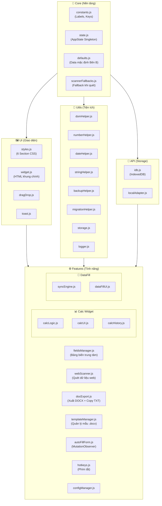

# VNPT PROJECT BRAIN CONTEXT (OPTIMIZED)
*Ngày cập nhật: 12:31:53 12/4/2026*

## 1. TÀI LIỆU CỐT LÕI (CORE DOCUMENTS)

### File: PROJECT_MEMORY.md

# VNPT Project Memory

File này lưu trữ các quyết định quan trọng, lỗi đặc thù và trạng thái dự án để AI luôn duy trì được bối cảnh giữa các phiên làm việc.

## 1. Mục tiêu hiện tại (Current Objective)

- [x] Triển khai giao diện Glassmorphism cao cấp.
- [x] Hợp nhất menu cài đặt và sao lưu.
- [x] Hệ thống kiểm tra dữ liệu bắt buộc (Required Fields Validation).
- [x] Cải thiện hệ thống "Trí nhớ dự án" (Đã khôi phục và đồng bộ).
- [x] Kiểm tra tính nhất quán của hệ thống Rules/Workflow với người dùng.
- [x] Triển khai tính năng Phân loại dữ liệu Local (Raw Scan).
- [x] Xây dựng công cụ Selector Inspector (Bắt selector bằng click).
- [x] Tích hợp API tra cứu MST doanh nghiệp (Xinvoice).
- [x] Tự động hóa trường Nơi cấp ĐKDN theo Tỉnh (`SKDT {Tỉnh}`).
- [x] Sửa lỗi VNPT Calculator tự động nhảy về số 0 khi xóa trắng ô nhập liệu.
- [x] Cải tiến Field Linker: Hỗ trợ Smart Mapping (tìm label/wrapper id khi input yếu).
- [x] Tích hợp visual link (🔗) vào phần Mapping Calc trong Banner.
- [x] Tích hợp Quét nội dung Mail (Gmail/Outlook) và Quét Màn hình trực tiếp qua AI Scanner.


- [x] Chế độ Xem trước OCR (Side-by-Side Review).
- [x] Quản lý Profile Side B (Đã gỡ bỏ theo yêu cầu người dùng).
- [x] Hệ thống Validation & Error Highlighting.
- [x] Mở rộng Multi-Source Scan (Ảnh/PDF) & Tối ưu hóa AI Prompt (Snippet).
- [x] Tái cấu trúc UI AI Mode (Hàng đợi File, Glow Animation, Multi-Media).
- [x] Triển khai Cloud Integration Phase 2 (Team Collaboration).
- [x] Thư viện mẫu dùng chung (Shared Cloud Templates).
- [x] Hệ thống Selectors từ Cloud (Remote UI Patches).
- [x] Phân quyền Workspace (Workspace ID).
- [x] Phân nhóm Fields (Đã gỡ bỏ theo yêu cầu người dùng).


## 2. Nhật ký Quyết định (Decision Log)

- **2026-04-07 (Glassmorphism UI)**: Thay thế hoàn toàn giao diện cũ sang phong cách mờ đục (blur) với màu Indigo/Slate để tăng tính sang trọng.
- **2026-04-07 (Storage Abstraction)**: Di chuyển toàn bộ logic `localStorage` vào `src/api/storage/` để quản lý tập trung và tránh xung đột dữ liệu.
- **2026-04-09 (Memory System)**: Quyết định dùng file `PROJECT_MEMORY.md` kết hợp `.cursorrules` để AI "nhớ" tốt hơn.
- **2026-04-09 (Rules & Workflow Alignment)**: Giải thích cơ chế Slash Commands cho người dùng (không có menu tự động) v*Ngày cập nhật: 16:45:00 11/4/2026*

> [!NOTE]
> Để có cái nhìn chi tiết và đầy đủ nhất về toàn bộ logic dự án cho NotebookLM, hãy tham khảo file:
> [.notebooklm/PROJECT_REPORT_2026.04.10.md](file:///c:/Users/Chien/.gemini/antigravity/scratch/tampermonkey-vite/.notebooklm/PROJECT_REPORT_2026.04.10.md)
dẫn vào `RULES.md`.
- **2026-04-10 (Fix Slash Command Autocomplete)**: Phát hiện và sửa lỗi Extension UI không gọi được autocomplete do file `.gitignore` ẩn thư mục `.agents`. Đã cấu hình lại `.gitignore` và hoàn tác các rule sai lầm trước đó.
- **2026-04-10 (PDF Scan Button Enhancement)**: Bổ sung logic copy link hướng dẫn Gemini (GUIDE) vào clipboard nếu chưa cấu hình API Key khi bấm nút Scan PDF.
- **2026-04-10 (Startup Workflow)**: Triển khai `/start` để tự động hóa việc load bối cảnh dự án (brain_context + PROJECT_MEMORY).
- **2026-04-10 (NotebookLM Integration)**: Cấu hình Notebook dự án tại URL: `https://notebooklm.google.com/notebook/7e1829da-588e-42d2-8a87-afef88b6d3e7`. AI sẽ sử dụng URL này cho các tác vụ cập nhật brain mà không cần hỏi lại.
- **2026-04-10 (DOM Optimization)**: Triển khai `buildFullDOMMap` trong `domHelper.js` để chuyển đổi hiệu suất quét từ O(N*M) sang O(N+M), giúp widget xử lý nhanh ngay cả trên trang phức tạp.
- **2026-04-10 (Selector Inspector)**: Triển khai công cụ soi trường web giúp người dùng tự lấy selector mà không cần mở DevTools.
- **2026-04-10 (MST API Integration)**: Kết hợp tra cứu MST vào bảng fieldsManager để tự động điền thông tin doanh nghiệp.
- **2026-04-10 (UI/UX Refinement)**: Nâng cấp nút 🗑 thành Dual-mode (Clean All/JSON Backup/Delete Row).
- **2026-04-11 (XInvoice API)**: Tích hợp API XInvoice để tra cứu MST chính xác hơn, thay thế cơ chế cũ. Cấu hình headers `client-id` và `api-key`.
- **2026-04-11 (SKDT Automation)**: Triển khai logic tự động cập nhật trường "Nơi cấp ĐKDN" thành "SKDT {Tỉnh}" khi người dùng chọn Tỉnh/Thành phố.
- **2026-04-11 (Premium Upgrade Plan)**: Đề xuất 4 tính năng nâng cao (Grouping, OCR Review, Profiles, Validation) để chuyên nghiệp hóa công cụ.
- **2026-04-11 (Premium Implementation)**: Hoàn thành triển khai toàn bộ 4 tính năng Premium. Cấu trúc lại giao diện sang hệ thống Tab và Modal đối soát AI.
- **2026-04-11 (Grouping Revert)**: Gỡ bỏ tính năng Phân nhóm (Tabs) theo yêu cầu người dùng để quay lại danh sách phẳng.
- **2026-04-11 (PDF Scan UI Enhancement)**: Nâng cấp Modal đối soát PDF để luôn hiển thị đầy đủ các trường thông dụng (REQUIRED_KEYS) với nhãn Tiếng Việt, hỗ trợ nhập liệu thủ công khi AI bỏ sót.
- **2026-04-11 (Multi-Source Scan & Clipboard)**: Mở rộng khả năng quét AI cho cả định dạng Hình ảnh (.jpg, .png) và hỗ trợ thao tác Dán trực tiếp từ Clipboard (Ctrl+V), giúp tối ưu hóa quy trình làm việc từ ảnh chụp màn hình.
- **2026-04-11 (AI Model Upgrade & Prompt Optimization)**: Cập nhật danh sách Model AI chuẩn (Flash 2.0, Flash-Lite) và tối ưu hóa System Prompt để tăng tốc độ xử lý cho tài liệu nhiều trang, đảm bảo cân bằng giữa hiệu suất và độ chính xác.
- **2026-04-11 (AI Scanner UI Restructure)**: Tái cấu trúc lại luồng giao diện AI Mode. Gộp tính năng quét PDF/Ảnh và phân loại văn bản thô (Raw) vào một bảng điều khiển duy nhất. Hỗ trợ hiển thị "Hàng đợi tệp" (Queue) và hiệu ứng quét (Glow Animation) trực quan. Cập nhật Gemini API hỗ trợ truyền mảng file (Multimodal with array base64).
- **2026-04-11 (Calc Sync Fix)**: Sửa lỗi Sync không hoạt động bằng cách bổ sung nút kích hoạt thủ công (🔄), gán sự kiện onclick bị thiếu, và tích hợp tự động gọi buildFullDOMMap trước khi điền dữ liệu.
- **2026-04-11 (Dual-Action Restore)**: Nâng cấp nút Restore Last (⏪) hỗ trợ Click trái (Khôi phục ngay bản gần nhất) và Click phải (Mở menu lịch sử) để tối ưu hóa trải nghiệm người dùng.
- **2026-04-11 (Cloud Migration - Firebase)**: Chuyển đổi toàn bộ hạ tầng Cloud dự kiến từ Supabase sang Firebase theo yêu cầu người dùng. Triển khai Firebase Auth, Firestore Sync cho Profiles và mã hóa API Keys.
- **2026-04-11 (Calc Mapping UI Enhancement)**: Tích hợp hiển thị và chỉnh sửa trực tiếp 4 biến "Mapping Calc" vào khu vực banner khi ở chế độ "Dữ liệu mặc định VNPT", giúp tập trung toàn bộ cấu hình hệ thống vào một chỗ.
- **2026-04-11 (Process Optimization)**: Lược bỏ bước `npm run build` khỏi tất cả các quy trình Markdown (.agents/workflows/) để tối ưu hóa tốc độ phát triển. AI sẽ chỉ build khi thực sự cần thiết hoặc người dùng yêu cầu.
- **2026-04-11 (Shared Template Library)**: Hoàn thành Phase 2 Cloud Integration. Refactor `TemplateManager` hỗ trợ giao diện Tab (Local vs Cloud). Tích hợp logic lọc mẫu theo `workspace_id`.
- **2026-04-11 (Remote Config & Selectors)**: Triển khai `RemoteConfig` module để lấy selectors động từ Firebase, giúp fix lỗi UI trang đích mà không cần cập nhật mã nguồn Extension.
- **2026-04-11 (Date Sync Resolution)**: Sửa lỗi `ngayKy` bị treo khi tự động điền form (do LocalStorage lưu tĩnh timestamp). Đã thiết lập hàm `loadFreshenedDefaultData()` để luôn trộn đè các trường ngày tháng realtime (VD: `ngayKy`, `ngayTiepNhan`) từ `defaults.js` trong runtime lên cache của `SK_DATA_DEF` trong `dataFillFeature.js`.
- **2026-04-11 (Mapping Calc Cleanup)**: Loại bỏ các ô nhập liệu Mapping Calc dư thừa trong dropdown "More Tools" (id="vnpt-btn-more") vì đã được tích hợp tập trung vào giao diện "Dữ liệu mặc định VNPT".
- **2026-04-11 (Mapping Calc UI Refinement)**: Chuyển phần cấu hình Mapping Calc trong Banner sang dạng thu gọn (Collapsible Header), mặc định chỉ hiển thị 1 dòng tiêu đề để tiết kiệm diện tích.
- **2026-04-11 (Field Linker v2)**: Tính năng liên kết trực quan multi-link trên mỗi `vnpt-field-row`. Click 🔗 → widget mờ + banner nổi. Hover xanh dương = sẽ link, xanh lá = đã link, đỏ = sẽ unlink (toggle). Click tích lũy nhiều selectors (fix bug chỉ giữ `currentParts[0]`). Esc/✅ Xong dispatch `change` 1 lần → `syncThisRow()`. CSS: 3 states visual + badge counter + nút Xong trong banner.
- **2026-04-12 (Fix Calc Zero Default)**: Sửa lỗi calculator tự động điền số "0" khi người dùng xóa trắng (backspace hết) ô nhập liệu. Logic mới trong `calcLogic.js` sẽ trả về chuỗi rỗng thay vì "0", đồng thời xóa sạch các trường liên quan (Tiền thuế, Sau thuế, Bằng chữ) để UI sạch sẽ hơn.
- **2026-04-12 (Smart Field Linker)**: Nâng cấp `getBestSelector` để tự động leo lên thẻ cha tìm ID hoặc tìm Label lân cận nếu input không có thuộc tính định danh. Đồng thời cải tiến `findPageInput` để tự động resolve Wrapper ID về Input con bên trong, giúp mapping cực kỳ linh hoạt và ổn định.
- **2026-04-12 (Mapping Calc Linker)**: Tích hợp nút 🔗 vào giao diện cấu hình Mapping Calc trong Banner. Giờ đây người dùng có thể click trực tiếp để liên kết các ô Trước thuế, Sau thuế... với các element trên trang web một cách trực quan, tương tự như các field row thông thường.
- **2026-04-12 (Address Performance Optimization)**: Khắc phục triệt để hiện tượng giật lag khi gõ địa chỉ. Triển khai cơ chế Cooldown (3s) cho `buildFullDOMMap` và tối ưu hóa logic `scanFullAddress` để sử dụng cache thay vì quét lại DOM liên tục. Cải thiện logic ưu tiên chuỗi địa chỉ chi tiết nhất.
- **2026-04-12 (Full Label PDF Preview)**: Nâng cấp `handleExtractionResults` trong `pdfScan/index.js` để hiển thị toàn bộ danh sách trường từ `DEFAULT_LABELS` trong Dialog đối soát. Giúp người dùng dễ dàng kiểm tra và nhập thủ công mọi trường dữ liệu mà không bị giới hạn bởi danh sách `REQUIRED_KEYS`.
- **2026-04-12 (PDF Preview Filtering)**: Bổ sung bộ lọc `EXCLUDED_LABELS` vào bảng đối soát PDF để ẩn các trường mang tính chất mặc định hoặc ít thay đổi (Ngày/Tháng/Năm ký, Số lượng gói, Nơi ký, Liên hệ A).
- **2026-04-12 (Storage Fix - API Key & Raw Text)**: Khắc phục lỗi Raw Text không lưu được (triển khai `SK_RAW_SCAN`). Giữ nguyên sự kiện `onchange` cho API Key để tránh ghi đĩa liên tục.
- **2026-04-12 (Disable Autofill)**: Thêm `autocomplete="off"` vào input API Key để ngăn trình duyệt tự động điền (autofill) các key không mong muốn.
- **2026-04-12 (PDF Preview Filtering - Thorough)**: Nâng cấp bộ lọc EXCLUDED_LABELS và bổ sung EXCLUDED_KEYS để loại bỏ hoàn toàn Ngày/Tháng/Năm ký khỏi bảng đối soát, kể cả khi AI trả về các key này ngoài dự kiến. Loại bỏ `ngayKy` khỏi AI Prompt.
- **2026-04-12 (Storage JSON Bugfix)**: Sửa lỗi `Storage.get()` bị crash khi parse các chuỗi không phải JSON (như API Key). Đồng bộ hóa việc dùng `JSON.stringify` cho cả GM và LocalStorage để đảm bảo tính nhất quán.
- **2026-04-12 (UI Rule Update)**: Cập nhật quy tắc thiết kế UI: Tiêu đề phải ngắn gọn, đúng chức năng; hạn chế icon đi kèm title; cho phép dùng icon độc lập.


## 3. Lỗi đặc thù & Giải pháp (Technical Gotchas)

- **VNPT Selectors**: Các input trên trang VNPT thường không có ID cố định. Luôn ưu tiên dùng `placeholder` hoặc `label` text qua `webScanner.js`.
- **Z-Index Layering**: Widget cần có `z-index: 99999`.
- **MutationObserver Performance**: Chỉ quan sát các node cụ thể để tránh lag trang.
- **File Read Error**: tool `view_file` có thể lỗi "unsupported mime type" với file `.md` trong `graphify-out`. Khắc phục: Dùng lệnh `type` của CMD/PowerShell.
- **Address Real-time Lag**: Việc gọi `buildFullDOMMap` trên mỗi sự kiện `input` gây lag cực nặng. Giải pháp: Sử dụng cooldown và cache map in `domHelper.js`.
- **Storage get/set Inconsistency**: Việc `GM_setValue` lưu raw string trong khi `localStorage` dùng `JSON.stringify` gây lỗi khi `JSON.parse` dữ liệu không phải JSON (như API Key). Giải pháp: Luôn stringify khi lưu và try-catch khi đọc.
- **Calc Sync vs DOM Map**: Tính năng Sync của Calculator phụ thuộc vào FullDOMMap. Nếu Map chưa được build (do chưa Quét dữ liệu), Sync sẽ không tìm thấy các trường trên web. Đã khắc phục bằng cách gọi buildFullDOMMap() bên trong logic Sync.

## 4. Trạng thái các tính năng (Status Map)

- **Export DOCX**: Hoạt động ổn định.
- **Calc Widget**: Hoạt động ổn định, tích hợp sâu vào giao diện nhúng.
- **Sync Engine**: Hoạt động ổn định, hỗ trợ Sync thủ công (🔄) và tự động build DOM map trước khi điền.
- **Cloud Sync**: Hoạt động ổn định (Phòng làm việc Firebase). Hỗ trợ đồng bộ Profiles, API Keys, Thư viện mẫu dùng chung, Config tổng quát và Selectors từ xa.
- **Default Data Mode**: Hoàn thiện giao diện cấu hình tập trung, bao gồm cả biến dữ liệu và Mapping Calc. Đã loại bỏ hoàn toàn các cấu hình dư thừa ở các vị trí khác (như trong menu Công cụ).

---

_Ghi chú: AI phải cập nhật file này sau mỗi task lớn bằng workflow `/update-memory`._


---

### File: README.md

# VNPT Word Automation — Tampermonkey Userscript (Vite)

> **Phiên bản:** 1.5  |  **Build Tool:** Vite 5  |  **Môi trường:** Tampermonkey / hopdong.vnpt.vn

Userscript tự động hóa toàn bộ luồng nhập liệu hợp đồng VNPT:
- **Quét dữ liệu** từ portal web → điền tự động vào bảng biến
- **Xuất file DOCX** theo template có sẵn (URL Google Drive hoặc file local)
- **Copy text nhanh** bằng template văn bản tuỳ chỉnh (`@key` placeholder)
- **Tính thuế & phí dịch vụ** với bộ Calc Widget tích hợp
- **Đồng bộ hai chiều** giữa widget và các form trên trang web

---

## 📖 Mục lục

- [Tổng quan kiến trúc](#-tổng-quan-kiến-trúc)
- [Cấu trúc thư mục](#-cấu-trúc-thư-mục)
- [Module Map chi tiết](#-module-map-chi-tiết)
- [Hướng dẫn cài đặt & phát triển](#-hướng-dẫn-cài-đặt--phát-triển)
- [Luồng dữ liệu (Data Flow)](#-luồng-dữ-liệu-data-flow)
- [Tính năng chi tiết](#-tính-năng-chi-tiết)
- [Cấu hình & LocalStorage Keys](#-cấu-hình--localstorage-keys)
- [Quy tắc dành cho AI Agent](#-quy-tắc-dành-cho-ai-agent)

---

## 🏗️ Tổng quan kiến trúc

Dự án áp dụng **kiến trúc phân lớp** (Layered Architecture) loại bỏ hoàn toàn circular dependency. Các lớp giao tiếp một chiều từ trên xuống dưới, và sử dụng **Event Bus** để các module giao tiếp ngang hàng mà không cần `import` trực tiếp lẫn nhau.



---

## 📂 Cấu trúc thư mục

```text
tampermonkey-vite/
│
├── 📄 package.json          # Dependencies & npm scripts
├── 📄 vite.config.js        # Cấu hình build Vite + Tampermonkey Header banner

... (phần còn lại đã được lược bỏ để tiết kiệm context) ...

---

## 2. TÓM TẮT CẤU TRÚC MÃ NGUỒN (CODE LOGIC SUMMARIES)

### Thư mục: src/core

| File | Mô tả |
| :--- | :--- |
| constants.js | /**<br>* @file constants.js<br>* @desc Tất cả hằng số dùng chung toàn dự án: localStorage keys, DEFAULT_LABELS.<br>* @exports DEFAULT_LABELS    — map{id → tên nhãn tiếng Việt} dùng cho webScanner<br>* @exports LOCAL_KEY_*       — localStorage keys cho VNPT Export Widget<br>* @exports SK_*              — localStorage keys cho Calc & AutoFill Widget<br>* @seeAlso core/defaults.js (data mặc định), core/state.js (AppState)<br>*/ |
| defaults.js | /**<br>* @file defaults.js<br>* @desc Dữ liệu mặc định cho bên B (VNPT Hà Nội).<br>*       File này KHÔNG chứa logic — chỉ là data thuần.<br>* @exports DEFAULT_DATA  — object{key: string} dùng làm giá trị mặc định<br>* @seeAlso syncEngine.js (consumer), fieldsManager.js (consumer)<br>*/ |
| scannerFallbacks.js | /**<br>* @file scannerFallbacks.js<br>* @desc Cấu hình các giá trị mặc định cho scanner khi không tìm thấy dữ liệu trên web.<br>*       Tách riêng logic gán giá trị mặc định (như ngày hiện tại, số lượng mặc định)<br>*       ra khỏi logic quét DOM.<br>*/<br>/**<br>* Lấy giá trị mặc định dựa trên ID của trường (field ID).<br>* @param {string} id_can_tim - ID của trường cần lấy fallback.<br>* @returns {string} Giá trị mặc định hoặc chuỗi rỗng. |
| state.js | /**<br>* @file state.js<br>* @desc Singleton AppState — lưu tham chiếu các DOM elements và trạng thái toàn cục.<br>*       Sử dụng Proxy để hỗ trợ reactivity (lắng nghe thay đổi qua .on()).<br>*/ |

### Thư mục: src/features

| File | Mô tả |
| :--- | :--- |
| autoFillForm.js | /**<br>* @file autoFillForm.js<br>* @desc Tự động điền và đồng bộ các trường cố định ngay khi trang load hoặc AJAX render form.<br>*       Sử dụng MutationObserver để detect form mới, sau đó điền: chức vụ, nơi cấp CCCD,<br>*       đồng bộ địa chỉ, SĐT, email, MST theo cặp field tương ứng.<br>* @exports setupAutoFillForm  — khởi tạo MutationObserver + chạy fill lần đầu<br>* @seeAlso utils/domHelper.js (syncSetValue), dataFillFeature.js (fill nâng cao)<br>*/<br>// src/features/autoFillForm.js |
| calcWidgetFeature.js | /**<br>* @file calcWidgetFeature.js<br>* @desc Khởi tạo và điều phối Calc & AutoFill Widget (widget phụ, nổi góc màn hình).<br>*       Bao gồm: title bar, calculator thuế (trước/thuế/sau/bằng chữ), lịch sử,<br>*       dock/undock, cấu hình field-mapping (⚙️), và gọi renderDataFillTabs().<br>* @exports initCalcWidget  — tạo toàn bộ DOM và gán logic cho widget<br>* @seeAlso dataFillFeature.js (tab data), ui/dragDrop.js (dock/drag), core/constants.js (SK_*)<br>*/<br>// src/features/calcWidgetFeature.js |
| configManager.js | /**<br>* @file configManager.js<br>* @desc Quản lý việc Nhập (Import) và Xuất (Export) cấu hình JSON cho VNPT Export Widget.<br>*       Bao gồm: Fields data, Templates list, Widget Position & Size.<br>* @exports exportConfig — Hàm xuất JSON tải về máy<br>* @exports importConfig — Hàm nhập JSON từ máy người dùng<br>*/ |
| dataFillFeature.js | /**<br>* @file dataFillFeature.js<br>* @desc Quản lý 3 tab dữ liệu (Custom / Default / Sync) trong Calc Widget.<br>*       Bao gồm: render giao diện tab, CRUD dữ liệu, import/export JSON,<br>*       và engine tự động đồng bộ field theo mapping khi user gõ trên trang.<br>* @exports renderDataFillTabs  — render toàn bộ phần Data vào widget<br>* @exports doFillData          — điền dữ liệu merged (default+custom) lên trang<br>* @exports doSyncData          — trigger đồng bộ theo sync-map thủ công<br>* @exports DEFAULT_DATA        — re-export từ core/defaults.js (backward compat)<br>* @seeAlso core/defaults.js (data), calcWidgetFeature.js (caller), core/constants.js (keys)<br>*/ |
| docExport.js | /**<br>* @file docExport.js<br>* @desc Xử lý xuất file DOCX từ template bằng docxtemplater + PizZip.<br>*       Bao gồm: render DOCX (fill data), tự động cập nhật tên file xuất,<br>*       và ưu tiên template: URL buffer → file local.<br>* @exports initDocExport  — gán click handler cho nút xuất DOCX và logic tên file<br>* @seeAlso templateManager.js (template buffer), fieldsManager.js (data source)<br>*/<br>// src/features/docExport.js |
| fieldsManager.js | /**<br>* @file fieldsManager.js<br>* @desc Quản lý bảng fields (danh sách key-value-label-sync) trong VNPT Export Widget.<br>*       Đã tối ưu: Sử dụng Storage utility, Reactive State (AppState.on), DOM Cache.<br>*/ |
| hotkeys.js | /**<br>* @file hotkeys.js<br>* @desc Quản lý phím tắt động cho toàn bộ ứng dụng.<br>*       Hỗ trợ cấu hình phím tắt, lưu trữ và ghi nhận phím mới từ UI.<br>*/ |
| profileManager.js | /**<br>* @file profileManager.js<br>* @desc Quản lý các cấu hình mặc định (Side B) cho từng chi nhánh VNPT khác nhau.<br>*/ |
| selectorInspector.js | /**<br>* @file selectorInspector.js<br>* @desc Công cụ "Soi" trường dữ liệu (Selector Inspector).<br>*       Giúp người dùng bắt ID/Name/FormControlName bằng cách di chuột và click trực tiếp trên web.<br>*/ |
| templateManager.js | /**<br>* @file templateManager.js<br>* @desc Quản lý danh sách template DOCX (lưu URL hoặc file local qua IndexedDB).<br>*       Bao gồm: load/save danh sách, fetch từ URL (Google Drive), lưu file local vào<br>*       IndexedDB (idbSave/idbLoad), render UI danh sách, chọn/xoá/đổi tên template.<br>* @exports loadTemplates         — đọc danh sách template từ localStorage<br>* @exports fetchTemplateFromUrl  — tải ArrayBuffer từ URL qua GM_xmlhttpRequest<br>* @exports saveLocalTemplate     — lưu file local vào IDB + cập nhật danh sách<br>* @exports renderTemplateManager — render/refresh UI danh sách template vào container<br>* @seeAlso api/storage/idb.js (IndexedDB), widget.js (host container), docExport.js (consumer)<br>*/ |
| webScanner.js | /**<br>* @file webScanner.js<br>* @desc Quét các trường (fields) trên trang web và đồng bộ vào bảng fields của widget.<br>*       Bao gồm: nút "Quét" lấy values từ DOM theo DEFAULT_LABELS keys,<br>*       và listener input/change để tự động cập nhật khi user gõ trực tiếp trên web.<br>* @exports initWebScanner  — gán click/input/change listeners cho nút Quét<br>* @seeAlso core/constants.js (DEFAULT_LABELS), fieldsManager.js (addOrUpdateFieldRow)<br>*/ |

### Thư mục: src/api

| File | Mô tả |
| :--- | :--- |
| firebaseConfig.js | No description available. |
| firebaseService.js | No description available. |
| gemini.js | /**<br>* @file gemini.js<br>* @desc Utility để kết nối với Google Gemini API.<br>*       Hỗ trợ cả text-only và multimodal (image/pdf).<br>*/<br>/**<br>* Gọi API Gemini để xử lý nội dung.<br>* @param {Object} options - Các tùy chọn gọi API<br>* @param {string} options.apiKey - Gemini API Key<br>* @param {string} options.model - Tên mô hình (ví dụ: gemini-2.0-flash) |
| mstService.js | /**<br>* @file mstService.js<br>* @desc Dịch vụ tra cứu mã số thuế doanh nghiệp qua API VietQR.<br>*/ |
| remoteConfig.js | No description available. |

### Thư mục: src/utils

| File | Mô tả |
| :--- | :--- |
| backupHelper.js | /**<br>* @file backupHelper.js<br>* @desc Hỗ trợ xuất/nhập toàn bộ cấu hình dự án ra file JSON.<br>*/ |
| common.js | /**<br>* @file common.js<br>* @desc Các hàm tiện ích dùng chung (debounce, v.v.)<br>*/<br>/**<br>* Hàm chống rung (debounce)<br>* @param {Function} func<br>* @param {number} wait<br>* @returns {Function}<br>*/ |
| crypto.js | /**<br>* @file crypto.js<br>* @desc Cung cấp các hàm mã hóa/giải mã đơn giản để bảo vệ API Keys khi lưu trên Cloud.<br>*       Sử dụng kết hợp ID máy (nếu có thể) hoặc một salt cố định.<br>*/<br>// Một key đơn giản để obfuscate dữ liệu (có thể cải tiến bằng cách lấy fingerprint trình duyệt) |
| dateHelper.js | /**<br>* @file dateHelper.js<br>* @desc Các hàm bổ trợ xử lý ngày tháng năm.<br>*/ |
| domHelper.js | No description available. |
| fileHelper.js | /**<br>* @file fileHelper.js<br>* @desc Các hàm tiện ích xử lý tệp tin: Chuyển đổi URL/Blob sang Base64 trong môi trường Tampermonkey.<br>*/<br>/**<br>* Tải một file từ URL và chuyển sang Base64 dùng GM_xmlhttpRequest (để bypass CORS).<br>* @param {string} url<br>* @param {string} fileName<br>* @returns {Promise<{base64: string, mimeType: string, name: string}>}<br>*/ |
| localClassifier.js | /**<br>* @file localClassifier.js<br>* @desc Logic bóc tách dữ liệu từ văn bản thô bằng Regex (không dùng AI).<br>*       Tối ưu cho mẫu Giấy đăng ký doanh nghiệp và căn cước công dân.<br>*/<br>/**<br>* Các hàm helper chuẩn hóa dữ liệu<br>*/ |
| logger.js | No description available. |
| migrationHelper.js | No description available. |
| numberHelper.js | // src/utils/numberHelper.js |
| storage.js | /**<br>* @file storage.js<br>* @desc Tiện ích quản lý dữ liệu lưu trữ (Hỗ trợ localStorage và Tampermonkey GM_storage).<br>*       Đã tối ưu: JSON tự động, xử lý lỗi, Debounce ghi đĩa và Cache nội bộ.<br>*/ |
| stringHelper.js | /**<br>* @file stringHelper.js<br>* @desc Các hàm tiện ích xử lý chuỗi: Levenshtein distance, fuzzy matching.<br>*/<br>/**<br>* Tính khoảng cách Levenshtein giữa 2 chuỗi.<br>* @param {string} a<br>* @param {string} b<br>* @returns {number}<br>*/ |

## 3. DANH MỤC QUY TRÌNH (WORKFLOWS MAP)

- **/add-feature**: Quy trình chuẩn để tạo một module tính năng mới từ A-Z
- **/add-field**: Cách thêm một trường dữ liệu (field) mới vào toàn bộ hệ thống
- **/add-helper**: Cách thêm một hàm bổ trợ (helper) vào hệ thống
- **/add-template**: Quy trình thêm một mẫu Template DOCX từ Google Drive hoặc URL
- **/api-request**: Cách gọi API ngoài an toàn và đúng chuẩn Tampermonkey
- **/bug-report**: Quy trình báo cáo và sửa lỗi hiệu quả, tối thiểu token đầu vào.
- **/debug-ui**: Quy trình sửa lỗi hiển thị và tương tác trên web đích
- **/dev-all**: Quy trình build và chạy server phát triển song song
- **/export-json**: Quy trình bảo trì và cập nhật chức năng xuất/nhập file JSON (Backup)
- **/polish-ui**: Quy trình kiểm tra và làm đẹp giao diện (UI Polish)
- **/reset-all**: Quy trình xóa sạch dữ liệu cũ để bắt đầu môi trường test mới
- **/start**: Khôi phục bối cảnh dự án và tóm tắt trạng thái phiên làm việc trước đó.
- **/sync-logic**: Cách cấu hình để Widget tự động điền dữ liệu lên trang web
- **/test-sync**: Công cụ/Quy trình debug nhanh CSS selectors và IDs trên trang web VNPT
- **/update-memory**: Quy trình tóm tắt và cập nhật "Bộ nhớ dự án" sau mỗi task lớn.
- **/update-ui**: Quy trình cập nhật hoặc sửa đổi giao diện (CSS) cho các widget
- **/upnote**: Tổng hợp brain và đẩy lên NotebookLM dự án.
- **/_index**: Danh mục nhanh (Cheat-sheet) các workflow hệ thống

> *Lưu ý: Để xem chi tiết workflow, hãy dùng lệnh view_file trực tiếp vào file trong thư mục .agents/workflows/*

## 4. QUY TẮC DỰ ÁN (.cursorrules)

AI **PHẢI** tuân thủ bộ quy tắc trung tâm tại: [docs/RULES.md](file:///c:/Users/Chien/vnpt-tampermonkey-vite/docs/RULES.md)

### 🚀 Quy tắc Ưu tiên (Quick Reference):
1. AI **PHẢI** đọc [.notebooklm/brain_context.md](file:///c:/Users/Chien/vnpt-tampermonkey-vite/.notebooklm/brain_context.md) ngay khi bắt đầu.
2. **Planning First**: Lập `implementation_plan.md` và chờ xác nhận trước khi code.
3. **Execution**: Chỉ code sau khi người dùng gõ "ok", "trien khai" hoặc "y".
4. **Graphify**: Đọc `graphify-out/GRAPH_REPORT.md` để hiểu kiến trúc trước khi tìm code.
5. **Language**: Toàn bộ phản hồi và code comments là **Tiếng Việt**.
6. **Slash Commands**: Dùng phím `/` để mở menu gợi ý và chọn các workflow từ `.agents/workflows/` (ví dụ: `/update-memory`).

Xem chi tiết tại [RULES.md](file:///c:/Users/Chien/vnpt-tampermonkey-vite/docs/RULES.md) để biết về tiêu chuẩn JSDoc, Error Handling, State Management và Design System (Glassmorphism).


