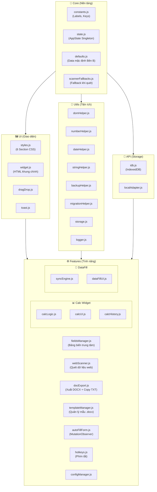

 VNPT PROJECT BRAIN CONTEXT
*Ngày cập nhật: 22:27:53 9/4/2026*

## 1. TÀI LIỆU CỐT LÕI (CORE DOCUMENTS)

### File: ARCHITECTURE.md

# VNPT Tampermonkey Script Architecture

## Overview
Dự án là một Tampermonkey Userscript dùng để tự động hóa việc nhập liệu và xuất file DOCX từ các biểu mẫu web của VNPT. Script được cấu trúc theo dạng module ESM, sử dụng Vite để build.

```mermaid
graph TD;
  Core[Core (constants, state, defaults)] --> UI[UI (widget, styles)];
  UI --> Features[Features];
  Features --> Utils[Utils];
  Features -->|điền dữ liệu| DataFill[dataFill];
  Features -->|tạo file| DocExport[docExport];
```

## Module Map

### 1. Core (State & Constants)
Các file lưu trữ cấu hình tĩnh và trạng thái runtime. AI nên đọc các file này trước để biết các hằng số và keys.

- [constants.js](file:///c:/Users/Chien/vnpt-tampermonkey-vite/src/core/constants.js): Chứa mapping nhãn (DEFAULT_LABELS) và các key của localStorage.
- [state.js](file:///c:/Users/Chien/vnpt-tampermonkey-vite/src/core/state.js): Singleton AppState lưu giữ tham chiếu đến các thành phần UI (DOM) và các cờ trạng thái (flags).
- [defaults.js](file:///c:/Users/Chien/vnpt-tampermonkey-vite/src/core/defaults.js): Chứa dữ liệu bên B mặc định (DEFAULT_DATA) và danh sách trường bên A (fieldsA).
- [scannerFallbacks.js](file:///c:/Users/Chien/vnpt-tampermonkey-vite/src/core/scannerFallbacks.js): [NEW] Xử lý logic dự phòng khi quét dữ liệu trang web không tìm thấy nhãn chuẩn.

### 2. UI (Giao diện)
Phần render và điều khiển layout của widget.

- [styles.js](file:///c:/Users/Chien/vnpt-tampermonkey-vite/src/ui/styles.js): Chứa toàn bộ CSS (với 6 Section Comments giúp AI định vị nhanh).
- [widget.js](file:///c:/Users/Chien/vnpt-tampermonkey-vite/src/ui/widget.js): Khởi tạo giao diện chính (Export Widget), quản lý resize/đóng mở.
- [dragDrop.js](file:///c:/Users/Chien/vnpt-tampermonkey-vite/src/ui/dragDrop.js): Logic kéo thả chung cho cả 2 widget chính.
- [toast.js](file:///c:/Users/Chien/vnpt-tampermonkey-vite/src/ui/toast.js): Hiển thị thông báo góc màn hình.

### 3. API (Giao tiếp & Lưu trữ)
Quản lý các kết nối ngoại vi và lưu trữ tập trung.

- [storage/](file:///c:/Users/Chien/vnpt-tampermonkey-vite/src/api/storage/): Quản lý lưu trữ dữ liệu (localStorage, GM_setValue) với cơ chế debounce và caching.

### 3. Features (Tính năng)
Logic nghiệp vụ chính của script.

- [calc/](file:///c:/Users/Chien/vnpt-tampermonkey-vite/src/features/calc/): Thư mục quản lý Calc Widget (Gồm Logic, UI, History).
  - [calcLogic.js](file:///c:/Users/Chien/vnpt-tampermonkey-vite/src/features/calc/calcLogic.js): Logic tính thuế & format số.
  - [calcUI.js](file:///c:/Users/Chien/vnpt-tampermonkey-vite/src/features/calc/calcUI.js): Khởi tạo DOM & Event Listeners.
- [dataFill/](file:///c:/Users/Chien/vnpt-tampermonkey-vite/src/features/dataFill/): Thư mục quản lý dữ liệu và đồng bộ (Tabs UI, Sync Engine).
  - [syncEngine.js](file:///c:/Users/Chien/vnpt-tampermonkey-vite/src/features/dataFill/syncEngine.js): Logic điền dữ liệu & lắng nghe sự kiện input toàn trang.
  - [dataFillUI.js](file:///c:/Users/Chien/vnpt-tampermonkey-vite/src/features/dataFill/dataFillUI.js): Giao diện 3 tab dữ liệu & Import/Export.
- [fieldsManager.js](file:///c:/Users/Chien/vnpt-tampermonkey-vite/src/features/fieldsManager.js): Quản lý bảng dữ liệu trung tâm của widget Export (CRUD, drag-sort).
- [docExport.js](file:///c:/Users/Chien/vnpt-tampermonkey-vite/src/features/docExport.js): Logic render file .docx bằng docxtemplater.
- [templateManager.js](file:///c:/Users/Chien/vnpt-tampermonkey-vite/src/features/templateManager.js): Quản lý các mẫu .docx (URL hoặc file local lưu trong IndexedDB).
- [webScanner.js](file:///c:/Users/Chien/vnpt-tampermonkey-vite/src/features/webScanner.js): Quét dữ liệu từ trang web đưa vào bảng quản lý.
- [autoFillForm.js](file:///c:/Users/Chien/vnpt-tampermonkey-vite/src/features/autoFillForm.js): Tự động điền các trường cố định ngay khi load form.

### 4. Utils (Tiện ích)
- [domHelper.js](file:///c:/Users/Chien/vnpt-tampermonkey-vite/src/utils/domHelper.js): Các hàm thao tác DOM (setValue, setPageField).
- [numberHelper.js](file:///c:/Users/Chien/vnpt-tampermonkey-vite/src/utils/numberHelper.js): Chuyển số -> chữ tiếng Việt, format tiền.
- [logger.js](file:///c:/Users/Chien/vnpt-tampermonkey-vite/src/utils/logger.js): Logging quản lý log ra console.

## Data Flow
1. **Quét dữ liệu**: Người dùng bấm nút "Quét" (`webScanner.js`) -> Dữ liệu đổ vào `fieldsManager.js` -> Lưu vào `localStorage (LOCAL_KEY_FIELDS)`.
2. **Xuất file**: Người dùng bấm "Xuất file" (`docExport.js`) -> Lấy template từ `templateManager.js` -> Lấy data từ `fieldsManager.js` -> Tải file về.
3. **Tính toán**: Nhập liệu vào Calc Widget (`calcWidgetFeature.js`) -> Đồng bộ ngược vào web hoặc Data Tabs (`dataFillFeature.js`).
4. **Tự động**: `autoFillForm.js` tự động điền ngay khi form xuất hiện qua `MutationObserver`.

## Token Optimization & Cheat Sheet

### 1. Cheat Sheet (Lược đồ nhanh)

| Component | File chính | Chức năng |
| :--- | :--- | :--- |
| **Giao diện** | [styles.js](file:///c:/Users/Chien/vnpt-tampermonkey-vite/src/ui/styles.js) | Chứa 100% CSS (Tìm theo Section Comments) |
| **Widget** | [widget.js](file:///c:/Users/Chien/vnpt-tampermonkey-vite/src/ui/widget.js) | Khung sườn UI chính |
| **Dữ liệu** | [constants.js](file:///c:/Users/Chien/vnpt-tampermonkey-vite/src/core/constants.js) | Chứa nhãn (Labels) và Keys cho storage |
| **Logic Tính** | [calcLogic.js](file:///c:/Users/Chien/vnpt-tampermonkey-vite/src/features/calc/calcLogic.js) | Thuế, format tiền, số -> chữ |
| **Đồng bộ** | [syncEngine.js](file:///c:/Users/Chien/vnpt-tampermonkey-vite/src/features/dataFill/syncEngine.js) | Điền dữ liệu từ widget vào trang web |
| **Xuất file** | [docExport.js](file:///c:/Users/Chien/vnpt-tampermonkey-vite/src/features/docExport.js) | Tạo file .docx |

### 2. Quy trình "Tiết kiệm Token" cho AI

1. **Grep-First**: Thay vì `view_file` toàn bộ 400 dòng `styles.js`, hãy dùng `grep_search` với từ khóa của Section (ví dụ: `/* Section 3: Tabs */`).
2. **Context-Aware Mapping**: Luôn đối chiếu `constants.js` trước khi sửa bất kỳ logic lấy dữ liệu nào.
3. **Skip Large Files**: Tuyệt đối không đọc `original_script.js` hay `source.js` trừ khi có chỉ thị đặc biệt.
4. **Workflow Check**: Xem `.agents/workflows/` để biết các bước thực hiện chuẩn cho các tác vụ lặp lại.
5. **JSDoc Header**: Chỉ đọc 20 dòng đầu của file để hiểu nhiệm vụ trước khi đào sâu code.

---
*Lưu ý: Toàn bộ code comments và tài liệu phải duy trì bằng Tiếng Việt.*


---

### File: PROJECT_MEMORY.md

# VNPT Project Memory

File này lưu trữ các quyết định quan trọng, lỗi đặc thù và trạng thái dự án để AI luôn duy trì được bối cảnh giữa các phiên làm việc.

## 1. Mục tiêu hiện tại (Current Objective)
- [x] Triển khai giao diện Glassmorphism cao cấp.
- [x] Hợp nhất menu cài đặt và sao lưu.
- [x] Hệ thống kiểm tra dữ liệu bắt buộc (Required Fields Validation).
- [/] Cải thiện hệ thống "Trí nhớ dự án" (Task hiện tại).

## 2. Nhật ký Quyết định (Decision Log)
- **2026-04-07 (Glassmorphism UI)**: Thay thế hoàn toàn giao diện cũ sang phong cách mờ đục (blur) với màu Indigo/Slate để tăng tính sang trọng.
- **2026-04-07 (Storage Abstraction)**: Di chuyển toàn bộ logic `localStorage` vào `src/api/storage/` để quản lý tập trung và tránh xung đột dữ liệu.
- **2026-04-09 (Memory System)**: Quyết định dùng file `PROJECT_MEMORY.md` kết hợp `.cursorrules` để AI "nhớ" tốt hơn thay vì chỉ dựa vào Context Window.

## 3. Lỗi đặc thù & Giải pháp (Technical Gotchas)
- **VNPT Selectors**: Các input trên trang VNPT thường không có ID cố định hoặc ID thay đổi theo phiên. Luôn ưu tiên dùng `placeholder` hoặc `label` text thông qua `webScanner.js`.
- **Z-Index Layering**: Widget cần có `z-index: 99999` để không bị đè bởi các modal của hệ thống VNPT.
- **MutationObserver Performance**: Khi quét form tự động, chỉ quan sát các node cụ thể thay vì toàn bộ `document.body` để tránh lag trang (đã tối ưu trong `autoFillForm.js`).

## 4. Trạng thái các tính năng (Status Map)
- **Export DOCX**: Hoạt động ổn định (Dùng docxtemplater).
- **Calc Widget**: Đã hợp nhất vào settings chính.
- **Sync Engine**: Hỗ trợ lắng nghe sự kiện `input` thời gian thực.

---
*Ghi chú: AI phải cập nhật file này sau mỗi task lớn bằng workflow `/update-memory`.*


---

### File: README.md

# VNPT Word Automation — Tampermonkey Userscript (Vite)

> **Phiên bản:** 1.5  |  **Build Tool:** Vite 5  |  **Môi trường:** Tampermonkey / hopdong.vnpt.vn

Userscript tự động hóa toàn bộ luồng nhập liệu hợp đồng VNPT:
- **Quét dữ liệu** từ portal web → điền tự động vào bảng biến
- **Xuất file DOCX** theo template có sẵn (URL Google Drive hoặc file local)
- **Copy text nhanh** bằng template văn bản tuỳ chỉnh (`@key` placeholder)
- **Tính thuế & phí dịch vụ** với bộ Calc Widget tích hợp
- **Đồng bộ hai chiều** giữa widget và các form trên trang web

---

## 📖 Mục lục

- [Tổng quan kiến trúc](#-tổng-quan-kiến-trúc)
- [Cấu trúc thư mục](#-cấu-trúc-thư-mục)
- [Module Map chi tiết](#-module-map-chi-tiết)
- [Hướng dẫn cài đặt & phát triển](#-hướng-dẫn-cài-đặt--phát-triển)
- [Luồng dữ liệu (Data Flow)](#-luồng-dữ-liệu-data-flow)
- [Tính năng chi tiết](#-tính-năng-chi-tiết)
- [Cấu hình & LocalStorage Keys](#-cấu-hình--localstorage-keys)
- [Quy tắc dành cho AI Agent](#-quy-tắc-dành-cho-ai-agent)

---

## 🏗️ Tổng quan kiến trúc

Dự án áp dụng **kiến trúc phân lớp** (Layered Architecture) loại bỏ hoàn toàn circular dependency. Các lớp giao tiếp một chiều từ trên xuống dưới, và sử dụng **Event Bus** để các module giao tiếp ngang hàng mà không cần `import` trực tiếp lẫn nhau.



---

## 📂 Cấu trúc thư mục

```text
tampermonkey-vite/
│
├── 📄 package.json          # Dependencies & npm scripts
├── 📄 vite.config.js        # Cấu hình build Vite + Tampermonkey Header banner
├── 📄 dev.user.js           # Script DEV: Hot Reload từ localhost (cài riêng vào TM)
├── 📄 .gitignore
│
└── src/
    ├── main.js              # Entry Point: Khởi động toàn bộ hệ thống
    │
    ├── core/                # Nền tảng — không import từ lớp nào khác
    │   ├── constants.js     # DEFAULT_LABELS, localStorage Keys, REQUIRED_KEYS
    │   ├── state.js         # Singleton AppState (DOM refs, drag state...)
    │   ├── defaults.js      # Dữ liệu mặc định Bên B + DEFAULT_SYNC_DATA + DEFAULT_CALC_MAP
    │   └── scannerFallbacks.js  # Logic fallback cho webScanner
    │
    ├── utils/               # Hàm tiện ích thuần (không có side-effect UI)
    │   ├── common.js        # debounce, throttle...
    │   ├── dateHelper.js    # getVNPTDateStrings() → {ngay, thang, nam}
    │   ├── domHelper.js     # setInputValue, setPageField, clearDOMCache
    │   ├── numberHelper.js  # Số → chữ tiếng Việt, formatMoney
    │   ├── stringHelper.js  # Xử lý chuỗi (trim, normalize...)
    │   ├── backupHelper.js  # Export/Import JSON trạng thái
    │   ├── migrationHelper.js   # Smart Merge LocalStorage khi deploy version mới
    │   ├── storage.js       # Wrapper localStorage với debounce & ký tự đặc biệt
    │   └── logger.js        # console.log có prefix & level
    │
    ├── api/
    │   └── storage/         # Adapter lưu trữ đa nguồn
    │       ├── index.js     # Factory: export { storage }
    │       ├── idb.js       # IndexedDB adapter (lưu file DOCX binary)
    │       └── localAdapter.js  # LocalStorage adapter
    │
    ├── ui/                  # Lớp giao diện
    │   ├── styles.js        # Toàn bộ CSS (6 Section Comments)
    │   ├── widget.js        # Khởi tạo HTML widget chính (Export Panel)
    │   ├── dragDrop.js      # Kéo thả 2 widget bằng mousedown/mousemove
    │   └── toast.js         # Thông báo góc màn hình
    │
    └── features/            # Logic tính năng (bulk of codebase)
        ├── main.js          # (Xem src/main.js — entry point)
        ├── fieldsManager.js # CRUD bảng field-rows, drag-sort, lưu localStorage
        ├── webScanner.js    # Quét DOM trang → fire EventBus 'ADD_FIELD'
        ├── docExport.js     # Xuất DOCX (docxtemplater) & Copy TXT clipboard
        ├── templateManager.js   # Quản lý mẫu DOCX: URL fetch ↔ IndexedDB
        ├── autoFillForm.js  # MutationObserver: điền form ngay khi xuất hiện
        ├── hotkeys.js       # Phím tắt toàn cục
        ├── configManager.js # Quản lý cấu hình người dùng
        │
        ├── calc/            # Calc Widget (tính thuế)
        │   ├── index.js     # initCalcWidget() — điểm khởi động
        │   ├── calcLogic.js # Tính thuế VAT, format số, số → chữ
        │   ├── calcUI.js    # DOM + Event Listeners cho Calc Widget
        │   └── calcHistory.js   # Lịch sử tính toán (before/after)
        │
        └── dataFill/        # DataFill Widget (đồng bộ dữ liệu)
            ├── index.js     # Re-export
            ├── dataFillUI.js    # Giao diện 3 tab: Default / Custom / Sync
            └── syncEngine.js    # Lắng nghe input toàn trang & điền ngược
```

---

## 🔍 Module Map chi tiết

### 1. `src/main.js` — Entry Point

Khởi tạo toàn bộ hệ thống theo thứ tự:

| Bước | Hàm | Mô tả |
|------|-----|-------|
| 1 | `initStorageMerge()` | Smart Merge LocalStorage trước khi dùng data |
| 2 | `injectStyles()` | Chèn CSS qua `GM_addStyle` |
| 3 | `initWidget()` | Dựng DOM widget chính vào trang |
| 4 | `initCalcWidget()` | Dựng Calc Widget |
| 5 | `initDragDrop()` | Cho phép kéo thả 2 widget |
| 6 | `initFieldsManager()` | Khởi tạo bảng quản lý biến |
| 7 | `loadSavedData()` | Tải dữ liệu cũ từ localStorage |
| 8 | `initWebScanner()` | Gắn nút quét và sự kiện thay đổi |
| 9 | `initDocExport()` | Gắn nút xuất DOCX & Copy TXT |
| 10 | `setupAutoFillForm()` | MutationObserver theo dõi form mới |
| 11 | `initSyncEngine()` | Engine đồng bộ ngầm |
| 12 | `initHotkeys()` | Đăng ký phím tắt |
| 13 | `MutationObserver` | Quản lý DOM Cache (xóa cache khi DOM thay đổi) |

> Script hỗ trợ **Hot Reload** qua `window.__vnptCleanup` và `window.__vnptInit`.

---

### 2. `src/core/` — Lớp nền tảng

#### `constants.js`

| Export | Kiểu | Mô tả |
|--------|------|-------|
| `DEFAULT_LABELS` | `{string: string}` | Map ID element → tên nhãn tiếng Việt (cho webScanner) |
| `REQUIRED_KEYS` | `string[]` | Danh sách key bắt buộc khi xuất file |
| `LOCAL_KEY_FIELDS` | `string` | Key lưu bảng biến export |
| `LOCAL_KEY_DEFAULT_FIELDS` | `string` | Key lưu biến mặc định |
| `LOCAL_KEY_POS` / `_SIZE` / `_OPENED` | `string` | UI state widget |
| `SK_DATA_DEF/CUS/SYNC` | `string` | Key lưu data autofill 3 tab |
| `SK_TAX`, `SK_HIST_B/A` | `string` | Key Calc Widget |
| `SK_TEMPLATES` | `string` | Key danh sách template DOCX |
| `SK_TXT_TEMPLATE` | `string` | Key nội dung text template (Copy TXT) |

#### `state.js`

Singleton `AppState` — tập trung mọi DOM reference và flag runtime:

| Property | Loại | Mô tả |
|----------|------|-------|
| `panel` | `HTMLElement` | Widget chính |
| `fieldsContainer` | `HTMLElement` | `<div>` chứa các field rows |
| `templateBuffer` | `ArrayBuffer \| null` | Buffer template DOCX đang active |
| `templateName` | `string` | Tên template cho auto-fill filename |
| `isDragging` | `boolean` | Trạng thái đang kéo widget |
| `offsetX / offsetY` | `number` | Vị trí chuột khi bắt đầu kéo |

#### `defaults.js`

Cấu hình dữ liệu mặc định:

| Export | Mô tả |
|--------|-------|
| `DEFAULT_DATA` | Data Bên B (VNPT Hà Nội): tên, địa chỉ, MST, STK, người đại diện, ngày ký tự động |
| `DEFAULT_SYNC_DATA` | Mapping đồng bộ: khi `soHopDong` thay đổi → các field liên quan cập nhật theo |
| `DEFAULT_CALC_MAP` | Mapping kết quả Calc Widget → ID field trên trang web |
| `DEFAULT_TAX_RATE` | Thuế suất mặc định: `0.08` (8%) |

---

### 3. `src/features/` — Lớp tính năng

#### `fieldsManager.js` (14 KB)

Bảng quản lý biến trung tâm. CRUD các field rows, drag-sort, lưu/tải localStorage.

| Hàm chính | Mô tả |
|-----------|-------|
| `initFieldsManager()` | Khởi tạo bảng, gắn event listeners |
| `loadSavedData()` | Tải data từ `LOCAL_KEY_FIELDS` |
| `addFieldRow(key, value)` | Thêm hàng mới vào bảng |
| `getFieldsData()` | Trả về `{ [key]: value }` từ toàn bộ rows |

#### `webScanner.js` (4.8 KB)

Quét DOM trang web theo `DEFAULT_LABELS`, điền kết quả vào bảng field rows.

**Cơ chế:** Tìm element theo `id` khớp với key trong `DEFAULT_LABELS` → lấy `value` hoặc `innerText`. Nếu không tìm thấy → dự phòng qua `scannerFallbacks.js`.

#### `docExport.js` (10 KB)

Hai chức năng xuất dữ liệu:

| Chức năng | Hàm | Mô tả |
|-----------|-----|-------|
| Xuất DOCX | `renderDocx(buffer, data, filename)` | Dùng `docxtemplater` + `PizZip` để render template |
| Copy TXT | `copyTxtToClipboard(template, data)` | Thay `@key` → value, copy vào Clipboard API |

**Ưu tiên template DOCX:**
1. `AppState.templateBuffer` (đã fetch từ URL)
2. File local (từ `<input type="file">`)

**Auto-filename:** Tự động tạo tên file từ `tenToChuc` + tên template, rút gọn các từ thừa (Công ty, TNHH, Cổ phần...).

#### `templateManager.js` (11 KB)

Quản lý danh sách template DOCX:

| Chức năng | Mô tả |
|-----------|-------|
| Lưu URL template | Fetch binary → lưu vào IndexedDB |
| Quản lý danh sách | CRUD template với `SK_TEMPLATES` key |
| Kích hoạt template | Gán `AppState.templateBuffer` để xuất |

#### `autoFillForm.js` (2.4 KB)

Dùng `MutationObserver` theo dõi DOM trang web. Khi phát hiện form mới load (SPA navigation), tự động điền các trường cố định không cần người dùng làm gì.

#### `hotkeys.js` (1.6 KB)

Đăng ký phím tắt toàn cục. Tham khảo file để biết các tổ hợp phím hiện có.

---

### 4. `src/features/calc/` — Calc Widget

| File | Mô tả |
|------|-------|
| `calcLogic.js` | Tính `truocThue`, `thue`, `sauThue` từ giá nhập; format số; chuyển số → chữ tiếng Việt |
| `calcUI.js` | DOM widget tính thuế, input listeners, hiển thị kết quả và sync ngược |
| `calcHistory.js` | Lưu/hiển thị lịch sử 2 giá trị `before` / `after` |
| `index.js` | `initCalcWidget()` — entry point |

**Luồng:** Nhập số → `calcLogic` tính → `calcUI` hiển thị → `DEFAULT_CALC_MAP` đồng bộ vào các field ID trên trang.

---

### 5. `src/features/dataFill/` — DataFill Widget (3 Tab)

| Tab | Nguồn dữ liệu | Mô tả |
|-----|---------------|-------|
| **Default** | `defaults.js → DEFAULT_DATA` | Thông tin Bên B cố định |
| **Custom** | `SK_DATA_CUS` (localStorage) | Dữ liệu tuỳ chỉnh người dùng nhập |
| **Sync** | `SK_DATA_SYNC` (localStorage) | Cấu hình đồng bộ liên trường |

**SyncEngine** (`syncEngine.js`): Lắng nghe event `input` toàn trang → khi field thay đổi → tìm trong mapping → tự động cập nhật các field liên quan.

---

### 6. `src/ui/` — Lớp giao diện

#### `styles.js` (24 KB) — 6 Section Comments

Dùng **grep theo Section** thay vì đọc toàn file:

| Section | Nội dung |
|---------|----------|
| `/* Section 1: Base & Layout */` | Widget container, panel, header |
| `/* Section 2: Fields Table */` | Bảng biến, field rows, input styles |
| `/* Section 3: Tabs */` | Tab navigation DataFill widget |
| `/* Section 4: Buttons */` | Export buttons, action buttons |
| `/* Section 5: Calc Widget */` | Giao diện tính thuế |
| `/* Section 6: Toast & Utils */` | Toast notifications, helpers |

#### `widget.js` (18 KB)

Dựng toàn bộ HTML widget Export, quản lý:
- **Resize**: 3 cỡ S / M / L
- **Collapse/Expand**: Ẩn/hiện nội dung
- **File input**: Styled button nhỏ gọn ẩn native input
- **Template Manager**: Danh sách template + nút "✔ Dùng"
- **Text Template**: Textarea nhập `@key` template + nút Copy

---

### 7. `src/utils/` — Tiện ích

| File | Hàm chính | Mô tả |
|------|-----------|-------|
| `domHelper.js` | `setInputValue(el, val)`, `setPageField(id, val)`, `clearDOMCache()` | Trigger React/Vue synthetic events khi set value |
| `numberHelper.js` | `docToText(n)`, `formatMoney(n)` | Số → chữ tiếng Việt, format VNĐ |
| `dateHelper.js` | `getVNPTDateStrings()` | Trả `{ngay, thang, nam}` từ ngày hiện tại |
| `stringHelper.js` | Utility chuỗi | Normalize, truncate, encode... |
| `backupHelper.js` | `exportJSON()`, `importJSON()` | Sao lưu/phục hồi toàn bộ localStorage state |
| `migrationHelper.js` | `initStorageMerge()` | Smart Merge: ghép data cũ với schema mới khi update version |
| `storage.js` | `Storage.get/set/setDebounced` | Wrapper localStorage với debounce để tránh write storm |
| `common.js` | `debounce(fn, ms)`, `throttle(fn, ms)` | Utility timing |
| `logger.js` | `logger.info/debug/error` | Prefix log với `[VNPT]` |

---

## 🚀 Hướng dẫn cài đặt & phát triển

### Yêu cầu

- **Node.js** >= 16
- **Tampermonkey** extension trên trình duyệt
- Truy cập trang `hopdong.vnpt.vn`

### Cài đặt

```bash
npm install
```

### Chế độ phát triển (Hot Reload)

```bash
# Chạy song song: build watch + file server
npm run dev:all
```

Sau đó cài **`dev.user.js`** vào Tampermonkey (thay thế script chính). Script này:
1. Polling mỗi 5 giây đến `http://localhost:8788/myscript.user.js`
2. Phát hiện thay đổi nội dung → gọi `window.__vnptCleanup()` để dọn dẹp version cũ
3. `eval()` script mới → `window.__vnptInit()` khởi tạo lại
4. **Không cần refresh trang** khi code thay đổi

> **Lưu ý:** `npm run dev` = `vite build --watch` (build không minify, `emptyOutDir: false`)
> **Lưu ý:** `npm run serve` = `serve dist --cors -p 8788` (local file server)

### Build phát hành

```bash
npm run build
```

Output: `dist/myscript.user.js` — file duy nhất dạng IIFE, kèm đầy đủ Tampermonkey Header, sẵn sàng phân phối.

**Tampermonkey Header tự động thêm vào:**

```js
// ==UserScript==
// @name         VNPT Word Automation (Vite)
// @version      1.5
// @match        *://hopdong.vnpt.vn/*
// @require      docxtemplater@3.37.11
// @require      pizzip@3.1.4
// @grant        GM_addStyle
// @grant        GM_xmlhttpRequest
// @connect      localhost, drive.google.com, raw.githubusercontent.com, *
// ==/UserScript==
```

### Cập nhật tự động

```
@updateURL  https://raw.githubusercontent.com/tranchien2000/vnpt-tampermonkey-vite/main/dist/myscript.user.js
@downloadURL https://raw.githubusercontent.com/tranchien2000/vnpt-tampermonkey-vite/main/dist/myscript.user.js
```

Người dùng cuối chỉ cần cài một lần — Tampermonkey tự kiểm tra cập nhật.

---

## 🔄 Luồng dữ liệu (Data Flow)

### 1. Quét dữ liệu từ trang web

```
Người dùng bấm "Quét"
    → webScanner.js đọc DEFAULT_LABELS
    → Tìm element trên DOM theo ID key
    → Fallback: scannerFallbacks.js nếu không khớp
    → Ghi kết quả vào bảng (fieldsManager.addFieldRow)
    → Auto-save vào localStorage (LOCAL_KEY_FIELDS)
```

### 2. Xuất file DOCX

```
Người dùng bấm "Xuất DOCX"
    → docExport.js lấy data từ fieldsManager.getFieldsData()
    → Kiểm tra REQUIRED_KEYS → cảnh báo nếu thiếu
    → Ưu tiên 1: AppState.templateBuffer (đã fetch URL)
    → Ưu tiên 2: file local từ <input type="file">
    → renderDocx(): PizZip + docxtemplater render
    → Tạo Blob → trigger download
```

### 3. Copy Text Template

```
Người dùng nhập text template (ví dụ: "Khách hàng @tenDaiDienn, MST: @soDkdn")
    → Lưu tự động vào localStorage (SK_TXT_TEMPLATE) với debounce 800ms
    → Bấm "Copy Text"
    → copyTxtToClipboard(): thay @key → value từ bảng fields
    → navigator.clipboard.writeText() → thông báo thành công
```

### 4. Tính thuế & đồng bộ

```
Nhập giá vào Calc Widget
    → calcLogic.js tính truocThue / thue / sauThue
    → calcUI.js hiển thị kết quả
    → DEFAULT_CALC_MAP mapping key → danh sách ID field trên trang
    → domHelper.setPageField() điền vào trang web (trigger synthetic event)
```

### 5. Auto-fill khi load form

```
autoFillForm.js: MutationObserver(document.body)
    → Phát hiện form mới xuất hiện (SPA navigation)
    → Điền các trường cố định từ DEFAULT_DATA + Custom Data
    → syncEngine.js lắng nghe 'input' event toàn trang
    → Khi soHopDong thay đổi → auto-fill các field liên quan (DEFAULT_SYNC_DATA)
```

---

## 🗄️ Cấu hình & LocalStorage Keys

### VNPT Export Widget

| Key | Mô tả |
|-----|-------|
| `vnpt_docx_fields` | Mảng JSON các field rows của bảng biến Export |
| `vnpt_docx_default_fields` | Các trường mặc định đã tuỳ chỉnh |
| `vnpt_docx_position` | Vị trí widget (top, left) |
| `vnpt_docx_size` | Cỡ widget: `'S'` / `'M'` / `'L'` |
| `vnpt_docx_opened` | Trạng thái mở/đóng widget |
| `vnpt_templates` | `[{name, url, lastUsed}]` — danh sách template DOCX |
| `vnpt_txt_template` | Nội dung text template cho Copy TXT |

### Calc & AutoFill Widget

| Key | Mô tả |
|-----|-------|
| `vnpt_autofill_data_default` | Data Tab Default (JSON) |
| `vnpt_autofill_data_custom` | Data Tab Custom (JSON) |
| `vnpt_autofill_data_sync` | Data Tab Sync mapping (JSON) |
| `vnpt_widget_pos` | Vị trí Calc Widget |
| `vnpt_widget_collapsed` | `'calc'` \| `'data'` \| `''` — trạng thái thu gọn |
| `vnpt_widget_datatab` | `'default'` \| `'custom'` — tab đang active |
| `vnd_tax_rate` | Thuế suất (mặc định 0.08) |
| `vnd_before_history` | Lịch sử giá trước thuế |
| `vnd_after_history` | Lịch sử giá sau thuế |
| `vnd_calc_map` | Custom mapping Calc → field IDs |

---

## 🤖 Quy tắc dành cho AI Agent

Dự án này được tối ưu cho các Agentic AI (Antigravity, Claude...).

### ✅ Làm đúng

| Quy tắc | Lý do |
|---------|-------|
| Đọc `ARCHITECTURE.md` trước tiên | Nắm bức tranh tổng thể, tiết kiệm action token |
| Kiểm tra `.agents/workflows/_index.md` | Có sẵn workflow cho các tác vụ lặp lại |
| Dùng `grep_search` thay vì `view_file` cho file > 100 dòng | Tiết kiệm token đọc |
| Đọc JSDoc header 20 dòng đầu của mỗi file | Hiểu nhiệm vụ trước khi đào sâu |
| Đối chiếu `constants.js` khi sửa logic lấy dữ liệu | Tránh dùng literal string thay key |
| Dùng `grep "/* Section"` trong `styles.js` để định vị CSS | File 24KB, Section Comment là "map" |

### ❌ Không làm

| Quy tắc | Lý do |
|---------|-------|
| Không đọc `dist/`, `node_modules/` | Mã đã build / vendor, không có ích |
| Không đọc `original_script.js`, `source.js`, `temp_vnpt*.js` | File legacy lớn (>25KB), chỉ lưu lại tham khảo |
| Không khai báo biến Global (ngoài `window.__vnptInit/Cleanup`) | Tránh rò rỉ bộ nhớ, conflict |
| Không dùng `import` chéo giữa module cùng lớp | Giữ kiến trúc phân lớp |

### Workflows sẵn có

| Slash command | Khi nào dùng |
|---------------|-------------|
| `/add-feature` | Tạo module tính năng mới |
| `/add-field` | Thêm trường dữ liệu vào hệ thống |
| `/add-helper` | Thêm hàm tiện ích mới vào `utils/` |
| `/add-template` | Thêm mẫu DOCX mới từ URL |
| `/api-request` | Gọi API ngoài an toàn với `GM_xmlhttpRequest` |
| `/debug-ui` | Sửa lỗi hiển thị CSS/HTML |
| `/dev-all` | Lệnh chạy môi trường dev |
| `/export-json` | Bảo trì tính năng Backup/Restore JSON |
| `/sync-logic` | Cấu hình đồng bộ widget → trang web |
| `/test-sync` | Debug CSS selectors trên trang đích |
| `/update-ui` | Cập nhật cấu trúc CSS widget |
| `/bug-report` | Tối ưu quy trình xử lý bug |
| `/polish-ui` | Tinh chỉnh giao diện |
| `/reset-all` | Reset data test |

---

## 🔑 Kỹ thuật nổi bật

### Hot Reload không cần refresh

`dev.user.js` polling localhost mỗi 5 giây, phát hiện nội dung thay đổi → gọi `cleanup()` dọn dẹp DOM cũ → `eval()` code mới → `init()` lại. Không cần F5.

### DOM Cache với MutationObserver

`domHelper.js` cache kết quả `document.getElementById()`. `main.js` dùng `MutationObserver` theo dõi `document.body`, khi DOM thay đổi lớn (form mới load) → `clearDOMCache()` để tránh stale reference.

### Smart Storage Migration

`migrationHelper.js` so sánh schema hiện tại với data cũ trong localStorage, tự động merge thêm key mới mà không mất data người dùng đã nhập.

### Multi-key Field System

`DEFAULT_LABELS` dùng chuỗi multi-key làm key (ví dụ: `"ngayKy, ngayKy1"`). Khi điền vào trang web, split theo dấu phẩy → set cho nhiều element ID cùng lúc.

### Template Priority Chain

Thứ tự ưu tiên khi xuất DOCX: **URL buffer** (đã fetch, lưu RAM) > **IndexedDB** (file local đã lưu) > **File input** (chọn file tức thời). Người dùng không cần chọn lại template mỗi lần.

---

*VNPT Word Automation — Tối ưu hóa quy trình nhập liệu hợp đồng nội bộ VNPT Hà Nội.*


---

## 2. TÓM TẮT CẤU TRÚC MÃ NGUỒN (CODE LOGIC SUMMARIES)

Phần này chứa mô tả chức năng của từng file quan trọng trong dự án.

### Thư mục: src/core

#### File: constants.js
**Mô tả:**
```javascript
/**
* @file constants.js
* @desc Tất cả hằng số dùng chung toàn dự án: localStorage keys, DEFAULT_LABELS.
* @exports DEFAULT_LABELS    — map{id → tên nhãn tiếng Việt} dùng cho webScanner
* @exports LOCAL_KEY_*       — localStorage keys cho VNPT Export Widget
* @exports SK_*              — localStorage keys cho Calc & AutoFill Widget
* @seeAlso core/defaults.js (data mặc định), core/state.js (AppState)
*/
```

#### File: defaults.js
**Mô tả:**
```javascript
/**
* @file defaults.js
* @desc Dữ liệu mặc định cho bên B (VNPT Hà Nội).
*       File này KHÔNG chứa logic — chỉ là data thuần.
* @exports DEFAULT_DATA  — object{key: string} dùng làm giá trị mặc định
* @seeAlso syncEngine.js (consumer), fieldsManager.js (consumer)
*/
```

#### File: scannerFallbacks.js
**Mô tả:**
```javascript
/**
* @file scannerFallbacks.js
* @desc Cấu hình các giá trị mặc định cho scanner khi không tìm thấy dữ liệu trên web.
*       Tách riêng logic gán giá trị mặc định (như ngày hiện tại, số lượng mặc định)
*       ra khỏi logic quét DOM.
*/
/**
* Lấy giá trị mặc định dựa trên ID của trường (field ID).
* @param {string} id_can_tim - ID của trường cần lấy fallback.
* @returns {string} Giá trị mặc định hoặc chuỗi rỗng.
*/
```

#### File: state.js
**Mô tả:**
```javascript
/**
* @file state.js
* @desc Singleton AppState — lưu tham chiếu các DOM elements và trạng thái toàn cục.
*       Sử dụng Proxy để hỗ trợ reactivity (lắng nghe thay đổi qua .on()).
*/
```

### Thư mục: src/features

#### File: autoFillForm.js
**Mô tả:**
```javascript
/**
* @file autoFillForm.js
* @desc Tự động điền và đồng bộ các trường cố định ngay khi trang load hoặc AJAX render form.
*       Sử dụng MutationObserver để detect form mới, sau đó điền: chức vụ, nơi cấp CCCD,
*       đồng bộ địa chỉ, SĐT, email, MST theo cặp field tương ứng.
* @exports setupAutoFillForm  — khởi tạo MutationObserver + chạy fill lần đầu
* @seeAlso utils/domHelper.js (syncSetValue), dataFillFeature.js (fill nâng cao)
*/
// src/features/autoFillForm.js
```

#### File: calcWidgetFeature.js
**Mô tả:**
```javascript
/**
* @file calcWidgetFeature.js
* @desc Khởi tạo và điều phối Calc & AutoFill Widget (widget phụ, nổi góc màn hình).
*       Bao gồm: title bar, calculator thuế (trước/thuế/sau/bằng chữ), lịch sử,
*       dock/undock, cấu hình field-mapping (⚙️), và gọi renderDataFillTabs().
* @exports initCalcWidget  — tạo toàn bộ DOM và gán logic cho widget
* @seeAlso dataFillFeature.js (tab data), ui/dragDrop.js (dock/drag), core/constants.js (SK_*)
*/
// src/features/calcWidgetFeature.js
```

#### File: configManager.js
**Mô tả:**
```javascript
/**
* @file configManager.js
* @desc Quản lý việc Nhập (Import) và Xuất (Export) cấu hình JSON cho VNPT Export Widget.
*       Bao gồm: Fields data, Templates list, Widget Position & Size.
* @exports exportConfig — Hàm xuất JSON tải về máy
* @exports importConfig — Hàm nhập JSON từ máy người dùng
*/
```

#### File: dataFillFeature.js
**Mô tả:**
```javascript
/**
* @file dataFillFeature.js
* @desc Quản lý 3 tab dữ liệu (Custom / Default / Sync) trong Calc Widget.
*       Bao gồm: render giao diện tab, CRUD dữ liệu, import/export JSON,
*       và engine tự động đồng bộ field theo mapping khi user gõ trên trang.
* @exports renderDataFillTabs  — render toàn bộ phần Data vào widget
* @exports doFillData          — điền dữ liệu merged (default+custom) lên trang
* @exports doSyncData          — trigger đồng bộ theo sync-map thủ công
* @exports DEFAULT_DATA        — re-export từ core/defaults.js (backward compat)
* @seeAlso core/defaults.js (data), calcWidgetFeature.js (caller), core/constants.js (keys)
*/
```

#### File: docExport.js
**Mô tả:**
```javascript
/**
* @file docExport.js
* @desc Xử lý xuất file DOCX từ template bằng docxtemplater + PizZip.
*       Bao gồm: render DOCX (fill data), tự động cập nhật tên file xuất,
*       và ưu tiên template: URL buffer → file local.
* @exports initDocExport  — gán click handler cho nút xuất DOCX và logic tên file
* @seeAlso templateManager.js (template buffer), fieldsManager.js (data source)
*/
// src/features/docExport.js
```

#### File: fieldsManager.js
**Mô tả:**
```javascript
/**
* @file fieldsManager.js
* @desc Quản lý bảng fields (danh sách key-value-label-sync) trong VNPT Export Widget.
*       Đã tối ưu: Sử dụng Storage utility, Reactive State (AppState.on), DOM Cache.
*/
```

#### File: hotkeys.js
**Mô tả:**
```javascript
/**
* @file hotkeys.js
* @desc Quản lý phím tắt động cho toàn bộ ứng dụng.
*       Hỗ trợ cấu hình phím tắt, lưu trữ và ghi nhận phím mới từ UI.
*/
```

#### File: templateManager.js
**Mô tả:**
```javascript
/**
* @file templateManager.js
* @desc Quản lý danh sách template DOCX (lưu URL hoặc file local qua IndexedDB).
*       Bao gồm: load/save danh sách, fetch từ URL (Google Drive), lưu file local vào
*       IndexedDB (idbSave/idbLoad), render UI danh sách, chọn/xoá/đổi tên template.
* @exports loadTemplates         — đọc danh sách template từ localStorage
* @exports fetchTemplateFromUrl  — tải ArrayBuffer từ URL qua GM_xmlhttpRequest
* @exports saveLocalTemplate     — lưu file local vào IDB + cập nhật danh sách
* @exports renderTemplateManager — render/refresh UI danh sách template vào container
* @seeAlso api/storage/idb.js (IndexedDB), widget.js (host container), docExport.js (consumer)
*/
// src/features/templateManager.js
// Quản lý mẫu template docx (lưu URL hoặc chuỗi Base64 local)
```

#### File: webScanner.js
**Mô tả:**
```javascript
/**
* @file webScanner.js
* @desc Quét các trường (fields) trên trang web và đồng bộ vào bảng fields của widget.
*       Bao gồm: nút "Quét" lấy values từ DOM theo DEFAULT_LABELS keys,
*       và listener input/change để tự động cập nhật khi user gõ trực tiếp trên web.
* @exports initWebScanner  — gán click/input/change listeners cho nút Quét
* @seeAlso core/constants.js (DEFAULT_LABELS), fieldsManager.js (addOrUpdateFieldRow)
*/
```

### Thư mục: src/api

#### File: mstService.js
**Mô tả:**
```javascript
/**
* @file mstService.js
* @desc Dịch vụ tra cứu mã số thuế doanh nghiệp qua API VietQR.
*/
```

### Thư mục: src/utils

#### File: backupHelper.js
**Mô tả:**
```javascript
/**
* @file backupHelper.js
* @desc Hỗ trợ xuất/nhập toàn bộ cấu hình dự án ra file JSON.
*/
```

#### File: common.js
**Mô tả:**
```javascript
/**
* @file common.js
* @desc Các hàm tiện ích dùng chung (debounce, v.v.)
*/
/**
* Hàm chống rung (debounce)
* @param {Function} func
* @param {number} wait
* @returns {Function}
*/
```

#### File: dateHelper.js
**Mô tả:**
```javascript
/**
* @file dateHelper.js
* @desc Các hàm bổ trợ xử lý ngày tháng năm.
*/
```

#### File: domHelper.js
**Mô tả:**
```javascript
No description available.
```

#### File: logger.js
**Mô tả:**
```javascript
No description available.
```

#### File: migrationHelper.js
**Mô tả:**
```javascript
No description available.
```

#### File: numberHelper.js
**Mô tả:**
```javascript
// src/utils/numberHelper.js
```

#### File: storage.js
**Mô tả:**
```javascript
/**
* @file storage.js
* @desc Tiện ích quản lý dữ liệu lưu trữ (Hỗ trợ localStorage và Tampermonkey GM_storage).
*       Đã tối ưu: JSON tự động, xử lý lỗi, Debounce ghi đĩa và Cache nội bộ.
*/
```

#### File: stringHelper.js
**Mô tả:**
```javascript
/**
* @file stringHelper.js
* @desc Các hàm tiện ích xử lý chuỗi: Levenshtein distance, fuzzy matching.
*/
/**
* Tính khoảng cách Levenshtein giữa 2 chuỗi.
* @param {string} a
* @param {string} b
* @returns {number}
*/
```

## 3. QUY TẮC DỰ ÁN (.cursorrules)

1. AI **LUÔN LUÔN** phải đọc [ARCHITECTURE.md](file:///c:/Users/Chien/vnpt-tampermonkey-vite/ARCHITECTURE.md) và [PROJECT_MEMORY.md](file:///c:/Users/Chien/vnpt-tampermonkey-vite/PROJECT_MEMORY.md) ngay khi bắt đầu phiên làm việc.
2. **Planning First**: Khi nhận yêu cầu mới (ngoại trừ hỏi đáp đơn thuần), AI **PHẢI** lập kế hoạch chi tiết trong `implementation_plan.md` (brain artifact) và chờ xác nhận.
3. **Execution Trigger**: AI chỉ được phép chỉnh sửa code (EXECUTION) sau khi người dùng ra lệnh "ok", "trien khai" hoặc đồng ý với kế hoạch.
4. AI phải đọc **JSDoc header** (20 dòng đầu) của file `src/` trước khi đọc toàn bộ.
5. **Grep-First Mandate**: Nếu file > 100 dòng, AI **PHẢI** dùng `grep_search` để tìm đoạn code cần sửa trước khi dùng `view_file`.
6. **Exclusion List**: Tuyệt đối KHÔNG đọc: `dist/`, `node_modules/`, `.git/`, `package-lock.json`, `original_script.js`, `source.js`, `temp_vnpt*.js`.
7. **Language Mandate**: Toàn bộ phản hồi, tài liệu, commit message và **code comments** phải dùng **Tiếng Việt**.
8. **Concise Response**: Phản hồi ngắn gọn, tập trung vào logic và diff code, không chào hỏi rườm rà.
9. **Workflow First**: Luôn kiểm tra thư mục `.agents/workflows/` trước khi thực hiện các tác vụ như thêm field, thêm feature, hoặc sửa UI.
10. **Error Handling**: Các hàm xử lý DOM hoặc API phải có `try-catch` và sử dụng `logger` từ `src/utils/logger.js`.
11. **JSDoc Style**: Mọi hàm export mới phải có JSDoc mô tả tham số và giá trị trả về.
12. **Tool Optimization**: Ưu tiên dùng `multi_replace_file_content` cho các thay đổi không liên tục trong cùng file.
13. **State Management Pattern**: Luôn sử dụng singleton `AppState` từ `src/core/state.js` để quản lý trạng thái runtime. Tuyệt đối không dùng biến toàn cục rải rác.
14. **Commit Message Standard**: Sử dụng định dạng: `[loại]: [mô tả ngắn bằng tiếng Việt]` (VD: `feat: thêm nút quét dữ liệu`). Loại bao gồm: `feat`, `fix`, `refactor`, `docs`, `style`.
15. **Advanced Error Handling**: Mọi hàm `async` phải bọc trong `try-catch`. Sử dụng `logger.error` để ghi lại lỗi và hiển thị `toast` cho người dùng nếu cần thiết.

## 2. UI/Aesthetics (Premium Standard)
- Theme: Dark Mode + Glassmorphism (blur, semi-transparent borders).
- Colors: HSL curated palettes (e.g., Indigo primary, Slate background).
- Typography: Outfit, Inter, hoặc Roboto (Google Fonts).
- Micro-animations: Hover effects, smooth transitions, loading states.
- Không dùng placeholder; dùng `generate_image`.


