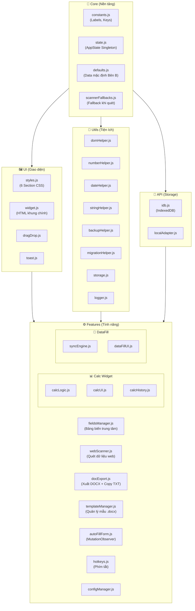

# VNPT PROJECT BRAIN CONTEXT
*Ngày cập nhật: 00:34:04 10/4/2026*

## 1. TÀI LIỆU CỐT LÕI (CORE DOCUMENTS)

### File: PROJECT_MEMORY.md

# VNPT Project Memory

File này lưu trữ các quyết định quan trọng, lỗi đặc thù và trạng thái dự án để AI luôn duy trì được bối cảnh giữa các phiên làm việc.

## 1. Mục tiêu hiện tại (Current Objective)
- [x] Triển khai giao diện Glassmorphism cao cấp.
- [x] Hợp nhất menu cài đặt và sao lưu.
- [x] Hệ thống kiểm tra dữ liệu bắt buộc (Required Fields Validation).
- [x] Cải thiện hệ thống "Trí nhớ dự án" (Đã khôi phục và đồng bộ).
- [x] Kiểm tra tính nhất quán của hệ thống Rules/Workflow với người dùng.

## 2. Nhật ký Quyết định (Decision Log)
- **2026-04-07 (Glassmorphism UI)**: Thay thế hoàn toàn giao diện cũ sang phong cách mờ đục (blur) với màu Indigo/Slate để tăng tính sang trọng.
- **2026-04-07 (Storage Abstraction)**: Di chuyển toàn bộ logic `localStorage` vào `src/api/storage/` để quản lý tập trung và tránh xung đột dữ liệu.
- **2026-04-09 (Memory System)**: Quyết định dùng file `PROJECT_MEMORY.md` kết hợp `.cursorrules` để AI "nhớ" tốt hơn.
- **2026-04-09 (Rules & Workflow Alignment)**: Giải thích cơ chế Slash Commands cho người dùng (không có menu tự động) và cập nhật hướng dẫn vào `RULES.md`.
- **2026-04-10 (Fix Slash Command Confusion)**: Cập nhật `.cursorrules` và `RULES.md` để nhấn mạnh lệnh manual và không có autocomplete.

## 3. Lỗi đặc thù & Giải pháp (Technical Gotchas)
- **VNPT Selectors**: Các input trên trang VNPT thường không có ID cố định. Luôn ưu tiên dùng `placeholder` hoặc `label` text qua `webScanner.js`.
- **Z-Index Layering**: Widget cần có `z-index: 99999`.
- **MutationObserver Performance**: Chỉ quan sát các node cụ thể để tránh lag trang.

## 4. Trạng thái các tính năng (Status Map)
- **Export DOCX**: Hoạt động ổn định.
- **Calc Widget**: Đã hợp nhất vào settings.
- **Sync Engine**: Hỗ trợ lắng nghe sự kiện `input` thời gian thực.

---
*Ghi chú: AI phải cập nhật file này sau mỗi task lớn bằng workflow `/update-memory`.*


---

### File: README.md

# VNPT Word Automation — Tampermonkey Userscript (Vite)

> **Phiên bản:** 1.5  |  **Build Tool:** Vite 5  |  **Môi trường:** Tampermonkey / hopdong.vnpt.vn

Userscript tự động hóa toàn bộ luồng nhập liệu hợp đồng VNPT:
- **Quét dữ liệu** từ portal web → điền tự động vào bảng biến
- **Xuất file DOCX** theo template có sẵn (URL Google Drive hoặc file local)
- **Copy text nhanh** bằng template văn bản tuỳ chỉnh (`@key` placeholder)
- **Tính thuế & phí dịch vụ** với bộ Calc Widget tích hợp
- **Đồng bộ hai chiều** giữa widget và các form trên trang web

---

## 📖 Mục lục

- [Tổng quan kiến trúc](#-tổng-quan-kiến-trúc)
- [Cấu trúc thư mục](#-cấu-trúc-thư-mục)
- [Module Map chi tiết](#-module-map-chi-tiết)
- [Hướng dẫn cài đặt & phát triển](#-hướng-dẫn-cài-đặt--phát-triển)
- [Luồng dữ liệu (Data Flow)](#-luồng-dữ-liệu-data-flow)
- [Tính năng chi tiết](#-tính-năng-chi-tiết)
- [Cấu hình & LocalStorage Keys](#-cấu-hình--localstorage-keys)
- [Quy tắc dành cho AI Agent](#-quy-tắc-dành-cho-ai-agent)

---

## 🏗️ Tổng quan kiến trúc

Dự án áp dụng **kiến trúc phân lớp** (Layered Architecture) loại bỏ hoàn toàn circular dependency. Các lớp giao tiếp một chiều từ trên xuống dưới, và sử dụng **Event Bus** để các module giao tiếp ngang hàng mà không cần `import` trực tiếp lẫn nhau.



---

## 📂 Cấu trúc thư mục

```text
tampermonkey-vite/
│
├── 📄 package.json          # Dependencies & npm scripts
├── 📄 vite.config.js        # Cấu hình build Vite + Tampermonkey Header banner
├── 📄 dev.user.js           # Script DEV: Hot Reload từ localhost (cài riêng vào TM)
├── 📄 .gitignore
│
└── src/
    ├── main.js              # Entry Point: Khởi động toàn bộ hệ thống
    │
    ├── core/                # Nền tảng — không import từ lớp nào khác
    │   ├── constants.js     # DEFAULT_LABELS, localStorage Keys, REQUIRED_KEYS
    │   ├── state.js         # Singleton AppState (DOM refs, drag state...)
    │   ├── defaults.js      # Dữ liệu mặc định Bên B + DEFAULT_SYNC_DATA + DEFAULT_CALC_MAP
    │   └── scannerFallbacks.js  # Logic fallback cho webScanner
    │
    ├── utils/               # Hàm tiện ích thuần (không có side-effect UI)
    │   ├── common.js        # debounce, throttle...
    │   ├── dateHelper.js    # getVNPTDateStrings() → {ngay, thang, nam}
    │   ├── domHelper.js     # setInputValue, setPageField, clearDOMCache
    │   ├── numberHelper.js  # Số → chữ tiếng Việt, formatMoney
    │   ├── stringHelper.js  # Xử lý chuỗi (trim, normalize...)
    │   ├── backupHelper.js  # Export/Import JSON trạng thái
    │   ├── migrationHelper.js   # Smart Merge LocalStorage khi deploy version mới
    │   ├── storage.js       # Wrapper localStorage với debounce & ký tự đặc biệt
    │   └── logger.js        # console.log có prefix & level
    │
    ├── api/
    │   └── storage/         # Adapter lưu trữ đa nguồn
    │       ├── index.js     # Factory: export { storage }
    │       ├── idb.js       # IndexedDB adapter (lưu file DOCX binary)
    │       └── localAdapter.js  # LocalStorage adapter
    │
    ├── ui/                  # Lớp giao diện
    │   ├── styles.js        # Toàn bộ CSS (6 Section Comments)
    │   ├── widget.js        # Khởi tạo HTML widget chính (Export Panel)
    │   ├── dragDrop.js      # Kéo thả 2 widget bằng mousedown/mousemove
    │   └── toast.js         # Thông báo góc màn hình
    │
    └── features/            # Logic tính năng (bulk of codebase)
        ├── main.js          # (Xem src/main.js — entry point)
        ├── fieldsManager.js # CRUD bảng field-rows, drag-sort, lưu localStorage
        ├── webScanner.js    # Quét DOM trang → fire EventBus 'ADD_FIELD'
        ├── docExport.js     # Xuất DOCX (docxtemplater) & Copy TXT clipboard
        ├── templateManager.js   # Quản lý mẫu DOCX: URL fetch ↔ IndexedDB
        ├── autoFillForm.js  # MutationObserver: điền form ngay khi xuất hiện
        ├── hotkeys.js       # Phím tắt toàn cục
        ├── configManager.js # Quản lý cấu hình người dùng
        │
        ├── calc/            # Calc Widget (tính thuế)
        │   ├── index.js     # initCalcWidget() — điểm khởi động
        │   ├── calcLogic.js # Tính thuế VAT, format số, số → chữ
        │   ├── calcUI.js    # DOM + Event Listeners cho Calc Widget
        │   └── calcHistory.js   # Lịch sử tính toán (before/after)
        │
        └── dataFill/        # DataFill Widget (đồng bộ dữ liệu)
            ├── index.js     # Re-export
            ├── dataFillUI.js    # Giao diện 3 tab: Default / Custom / Sync
            └── syncEngine.js    # Lắng nghe input toàn trang & điền ngược
```

---

## 🔍 Module Map chi tiết

### 1. `src/main.js` — Entry Point

Khởi tạo toàn bộ hệ thống theo thứ tự:

| Bước | Hàm | Mô tả |
|------|-----|-------|
| 1 | `initStorageMerge()` | Smart Merge LocalStorage trước khi dùng data |
| 2 | `injectStyles()` | Chèn CSS qua `GM_addStyle` |
| 3 | `initWidget()` | Dựng DOM widget chính vào trang |
| 4 | `initCalcWidget()` | Dựng Calc Widget |
| 5 | `initDragDrop()` | Cho phép kéo thả 2 widget |
| 6 | `initFieldsManager()` | Khởi tạo bảng quản lý biến |
| 7 | `loadSavedData()` | Tải dữ liệu cũ từ localStorage |
| 8 | `initWebScanner()` | Gắn nút quét và sự kiện thay đổi |
| 9 | `initDocExport()` | Gắn nút xuất DOCX & Copy TXT |
| 10 | `setupAutoFillForm()` | MutationObserver theo dõi form mới |
| 11 | `initSyncEngine()` | Engine đồng bộ ngầm |
| 12 | `initHotkeys()` | Đăng ký phím tắt |
| 13 | `MutationObserver` | Quản lý DOM Cache (xóa cache khi DOM thay đổi) |

> Script hỗ trợ **Hot Reload** qua `window.__vnptCleanup` và `window.__vnptInit`.

---

### 2. `src/core/` — Lớp nền tảng

#### `constants.js`

| Export | Kiểu | Mô tả |
|--------|------|-------|
| `DEFAULT_LABELS` | `{string: string}` | Map ID element → tên nhãn tiếng Việt (cho webScanner) |
| `REQUIRED_KEYS` | `string[]` | Danh sách key bắt buộc khi xuất file |
| `LOCAL_KEY_FIELDS` | `string` | Key lưu bảng biến export |
| `LOCAL_KEY_DEFAULT_FIELDS` | `string` | Key lưu biến mặc định |
| `LOCAL_KEY_POS` / `_SIZE` / `_OPENED` | `string` | UI state widget |
| `SK_DATA_DEF/CUS/SYNC` | `string` | Key lưu data autofill 3 tab |
| `SK_TAX`, `SK_HIST_B/A` | `string` | Key Calc Widget |
| `SK_TEMPLATES` | `string` | Key danh sách template DOCX |
| `SK_TXT_TEMPLATE` | `string` | Key nội dung text template (Copy TXT) |

#### `state.js`

Singleton `AppState` — tập trung mọi DOM reference và flag runtime:

| Property | Loại | Mô tả |
|----------|------|-------|
| `panel` | `HTMLElement` | Widget chính |
| `fieldsContainer` | `HTMLElement` | `<div>` chứa các field rows |
| `templateBuffer` | `ArrayBuffer \| null` | Buffer template DOCX đang active |
| `templateName` | `string` | Tên template cho auto-fill filename |
| `isDragging` | `boolean` | Trạng thái đang kéo widget |
| `offsetX / offsetY` | `number` | Vị trí chuột khi bắt đầu kéo |

#### `defaults.js`

Cấu hình dữ liệu mặc định:

| Export | Mô tả |
|--------|-------|
| `DEFAULT_DATA` | Data Bên B (VNPT Hà Nội): tên, địa chỉ, MST, STK, người đại diện, ngày ký tự động |
| `DEFAULT_SYNC_DATA` | Mapping đồng bộ: khi `soHopDong` thay đổi → các field liên quan cập nhật theo |
| `DEFAULT_CALC_MAP` | Mapping kết quả Calc Widget → ID field trên trang web |
| `DEFAULT_TAX_RATE` | Thuế suất mặc định: `0.08` (8%) |

---

### 3. `src/features/` — Lớp tính năng

#### `fieldsManager.js` (14 KB)

Bảng quản lý biến trung tâm. CRUD các field rows, drag-sort, lưu/tải localStorage.

| Hàm chính | Mô tả |
|-----------|-------|
| `initFieldsManager()` | Khởi tạo bảng, gắn event listeners |
| `loadSavedData()` | Tải data từ `LOCAL_KEY_FIELDS` |
| `addFieldRow(key, value)` | Thêm hàng mới vào bảng |
| `getFieldsData()` | Trả về `{ [key]: value }` từ toàn bộ rows |

#### `webScanner.js` (4.8 KB)

Quét DOM trang web theo `DEFAULT_LABELS`, điền kết quả vào bảng field rows.

**Cơ chế:** Tìm element theo `id` khớp với key trong `DEFAULT_LABELS` → lấy `value` hoặc `innerText`. Nếu không tìm thấy → dự phòng qua `scannerFallbacks.js`.

#### `docExport.js` (10 KB)

Hai chức năng xuất dữ liệu:

| Chức năng | Hàm | Mô tả |
|-----------|-----|-------|
| Xuất DOCX | `renderDocx(buffer, data, filename)` | Dùng `docxtemplater` + `PizZip` để render template |
| Copy TXT | `copyTxtToClipboard(template, data)` | Thay `@key` → value, copy vào Clipboard API |

**Ưu tiên template DOCX:**
1. `AppState.templateBuffer` (đã fetch từ URL)
2. File local (từ `<input type="file">`)

**Auto-filename:** Tự động tạo tên file từ `tenToChuc` + tên template, rút gọn các từ thừa (Công ty, TNHH, Cổ phần...).

#### `templateManager.js` (11 KB)

Quản lý danh sách template DOCX:

| Chức năng | Mô tả |
|-----------|-------|
| Lưu URL template | Fetch binary → lưu vào IndexedDB |
| Quản lý danh sách | CRUD template với `SK_TEMPLATES` key |
| Kích hoạt template | Gán `AppState.templateBuffer` để xuất |

#### `autoFillForm.js` (2.4 KB)

Dùng `MutationObserver` theo dõi DOM trang web. Khi phát hiện form mới load (SPA navigation), tự động điền các trường cố định không cần người dùng làm gì.

#### `hotkeys.js` (1.6 KB)

Đăng ký phím tắt toàn cục. Tham khảo file để biết các tổ hợp phím hiện có.

---

### 4. `src/features/calc/` — Calc Widget

| File | Mô tả |
|------|-------|
| `calcLogic.js` | Tính `truocThue`, `thue`, `sauThue` từ giá nhập; format số; chuyển số → chữ tiếng Việt |
| `calcUI.js` | DOM widget tính thuế, input listeners, hiển thị kết quả và sync ngược |
| `calcHistory.js` | Lưu/hiển thị lịch sử 2 giá trị `before` / `after` |
| `index.js` | `initCalcWidget()` — entry point |

**Luồng:** Nhập số → `calcLogic` tính → `calcUI` hiển thị → `DEFAULT_CALC_MAP` đồng bộ vào các field ID trên trang.

---

### 5. `src/features/dataFill/` — DataFill Widget (3 Tab)

| Tab | Nguồn dữ liệu | Mô tả |
|-----|---------------|-------|
| **Default** | `defaults.js → DEFAULT_DATA` | Thông tin Bên B cố định |
| **Custom** | `SK_DATA_CUS` (localStorage) | Dữ liệu tuỳ chỉnh người dùng nhập |
| **Sync** | `SK_DATA_SYNC` (localStorage) | Cấu hình đồng bộ liên trường |

**SyncEngine** (`syncEngine.js`): Lắng nghe event `input` toàn trang → khi field thay đổi → tìm trong mapping → tự động cập nhật các field liên quan.

---

### 6. `src/ui/` — Lớp giao diện

#### `styles.js` (24 KB) — 6 Section Comments

Dùng **grep theo Section** thay vì đọc toàn file:

| Section | Nội dung |
|---------|----------|
| `/* Section 1: Base & Layout */` | Widget container, panel, header |
| `/* Section 2: Fields Table */` | Bảng biến, field rows, input styles |
| `/* Section 3: Tabs */` | Tab navigation DataFill widget |
| `/* Section 4: Buttons */` | Export buttons, action buttons |
| `/* Section 5: Calc Widget */` | Giao diện tính thuế |
| `/* Section 6: Toast & Utils */` | Toast notifications, helpers |

#### `widget.js` (18 KB)

Dựng toàn bộ HTML widget Export, quản lý:
- **Resize**: 3 cỡ S / M / L
- **Collapse/Expand**: Ẩn/hiện nội dung
- **File input**: Styled button nhỏ gọn ẩn native input
- **Template Manager**: Danh sách template + nút "✔ Dùng"
- **Text Template**: Textarea nhập `@key` template + nút Copy

---

### 7. `src/utils/` — Tiện ích

| File | Hàm chính | Mô tả |
|------|-----------|-------|
| `domHelper.js` | `setInputValue(el, val)`, `setPageField(id, val)`, `clearDOMCache()` | Trigger React/Vue synthetic events khi set value |
| `numberHelper.js` | `docToText(n)`, `formatMoney(n)` | Số → chữ tiếng Việt, format VNĐ |
| `dateHelper.js` | `getVNPTDateStrings()` | Trả `{ngay, thang, nam}` từ ngày hiện tại |
| `stringHelper.js` | Utility chuỗi | Normalize, truncate, encode... |
| `backupHelper.js` | `exportJSON()`, `importJSON()` | Sao lưu/phục hồi toàn bộ localStorage state |
| `migrationHelper.js` | `initStorageMerge()` | Smart Merge: ghép data cũ với schema mới khi update version |
| `storage.js` | `Storage.get/set/setDebounced` | Wrapper localStorage với debounce để tránh write storm |
| `common.js` | `debounce(fn, ms)`, `throttle(fn, ms)` | Utility timing |
| `logger.js` | `logger.info/debug/error` | Prefix log với `[VNPT]` |

---

## 🚀 Hướng dẫn cài đặt & phát triển

### Yêu cầu

- **Node.js** >= 16
- **Tampermonkey** extension trên trình duyệt
- Truy cập trang `hopdong.vnpt.vn`

### Cài đặt

```bash
npm install
```

### Chế độ phát triển (Hot Reload)

```bash
# Chạy song song: build watch + file server
npm run dev:all
```

Sau đó cài **`dev.user.js`** vào Tampermonkey (thay thế script chính). Script này:
1. Polling mỗi 5 giây đến `http://localhost:8788/myscript.user.js`
2. Phát hiện thay đổi nội dung → gọi `window.__vnptCleanup()` để dọn dẹp version cũ
3. `eval()` script mới → `window.__vnptInit()` khởi tạo lại
4. **Không cần refresh trang** khi code thay đổi

> **Lưu ý:** `npm run dev` = `vite build --watch` (build không minify, `emptyOutDir: false`)
> **Lưu ý:** `npm run serve` = `serve dist --cors -p 8788` (local file server)

### Build phát hành

```bash
npm run build
```

Output: `dist/myscript.user.js` — file duy nhất dạng IIFE, kèm đầy đủ Tampermonkey Header, sẵn sàng phân phối.

**Tampermonkey Header tự động thêm vào:**

```js
// ==UserScript==
// @name         VNPT Word Automation (Vite)
// @version      1.5
// @match        *://hopdong.vnpt.vn/*
// @require      docxtemplater@3.37.11
// @require      pizzip@3.1.4
// @grant        GM_addStyle
// @grant        GM_xmlhttpRequest
// @connect      localhost, drive.google.com, raw.githubusercontent.com, *
// ==/UserScript==
```

### Cập nhật tự động

```
@updateURL  https://raw.githubusercontent.com/tranchien2000/vnpt-tampermonkey-vite/main/dist/myscript.user.js
@downloadURL https://raw.githubusercontent.com/tranchien2000/vnpt-tampermonkey-vite/main/dist/myscript.user.js
```

Người dùng cuối chỉ cần cài một lần — Tampermonkey tự kiểm tra cập nhật.

---

## 🔄 Luồng dữ liệu (Data Flow)

### 1. Quét dữ liệu từ trang web

```
Người dùng bấm "Quét"
    → webScanner.js đọc DEFAULT_LABELS
    → Tìm element trên DOM theo ID key
    → Fallback: scannerFallbacks.js nếu không khớp
    → Ghi kết quả vào bảng (fieldsManager.addFieldRow)
    → Auto-save vào localStorage (LOCAL_KEY_FIELDS)
```

### 2. Xuất file DOCX

```
Người dùng bấm "Xuất DOCX"
    → docExport.js lấy data từ fieldsManager.getFieldsData()
    → Kiểm tra REQUIRED_KEYS → cảnh báo nếu thiếu
    → Ưu tiên 1: AppState.templateBuffer (đã fetch URL)
    → Ưu tiên 2: file local từ <input type="file">
    → renderDocx(): PizZip + docxtemplater render
    → Tạo Blob → trigger download
```

### 3. Copy Text Template

```
Người dùng nhập text template (ví dụ: "Khách hàng @tenDaiDienn, MST: @soDkdn")
    → Lưu tự động vào localStorage (SK_TXT_TEMPLATE) với debounce 800ms
    → Bấm "Copy Text"
    → copyTxtToClipboard(): thay @key → value từ bảng fields
    → navigator.clipboard.writeText() → thông báo thành công
```

### 4. Tính thuế & đồng bộ

```
Nhập giá vào Calc Widget
    → calcLogic.js tính truocThue / thue / sauThue
    → calcUI.js hiển thị kết quả
    → DEFAULT_CALC_MAP mapping key → danh sách ID field trên trang
    → domHelper.setPageField() điền vào trang web (trigger synthetic event)
```

### 5. Auto-fill khi load form

```
autoFillForm.js: MutationObserver(document.body)
    → Phát hiện form mới xuất hiện (SPA navigation)
    → Điền các trường cố định từ DEFAULT_DATA + Custom Data
    → syncEngine.js lắng nghe 'input' event toàn trang
    → Khi soHopDong thay đổi → auto-fill các field liên quan (DEFAULT_SYNC_DATA)
```

---

## 🗄️ Cấu hình & LocalStorage Keys

### VNPT Export Widget

| Key | Mô tả |
|-----|-------|
| `vnpt_docx_fields` | Mảng JSON các field rows của bảng biến Export |
| `vnpt_docx_default_fields` | Các trường mặc định đã tuỳ chỉnh |
| `vnpt_docx_position` | Vị trí widget (top, left) |
| `vnpt_docx_size` | Cỡ widget: `'S'` / `'M'` / `'L'` |
| `vnpt_docx_opened` | Trạng thái mở/đóng widget |
| `vnpt_templates` | `[{name, url, lastUsed}]` — danh sách template DOCX |
| `vnpt_txt_template` | Nội dung text template cho Copy TXT |

### Calc & AutoFill Widget

| Key | Mô tả |
|-----|-------|
| `vnpt_autofill_data_default` | Data Tab Default (JSON) |
| `vnpt_autofill_data_custom` | Data Tab Custom (JSON) |
| `vnpt_autofill_data_sync` | Data Tab Sync mapping (JSON) |
| `vnpt_widget_pos` | Vị trí Calc Widget |
| `vnpt_widget_collapsed` | `'calc'` \| `'data'` \| `''` — trạng thái thu gọn |
| `vnpt_widget_datatab` | `'default'` \| `'custom'` — tab đang active |
| `vnd_tax_rate` | Thuế suất (mặc định 0.08) |
| `vnd_before_history` | Lịch sử giá trước thuế |
| `vnd_after_history` | Lịch sử giá sau thuế |
| `vnd_calc_map` | Custom mapping Calc → field IDs |

---

## 🤖 Quy tắc dành cho AI Agent

Dự án này được tối ưu cho các Agentic AI (Antigravity, Claude...).

### ✅ Làm đúng

| Quy tắc | Lý do |
|---------|-------|
| Đọc `ARCHITECTURE.md` trước tiên | Nắm bức tranh tổng thể, tiết kiệm action token |
| Kiểm tra `.agents/workflows/_index.md` | Có sẵn workflow cho các tác vụ lặp lại |
| Dùng `grep_search` thay vì `view_file` cho file > 100 dòng | Tiết kiệm token đọc |
| Đọc JSDoc header 20 dòng đầu của mỗi file | Hiểu nhiệm vụ trước khi đào sâu |
| Đối chiếu `constants.js` khi sửa logic lấy dữ liệu | Tránh dùng literal string thay key |
| Dùng `grep "/* Section"` trong `styles.js` để định vị CSS | File 24KB, Section Comment là "map" |

### ❌ Không làm

| Quy tắc | Lý do |
|---------|-------|
| Không đọc `dist/`, `node_modules/` | Mã đã build / vendor, không có ích |
| Không đọc `original_script.js`, `source.js`, `temp_vnpt*.js` | File legacy lớn (>25KB), chỉ lưu lại tham khảo |
| Không khai báo biến Global (ngoài `window.__vnptInit/Cleanup`) | Tránh rò rỉ bộ nhớ, conflict |
| Không dùng `import` chéo giữa module cùng lớp | Giữ kiến trúc phân lớp |

### Workflows sẵn có

| Slash command | Khi nào dùng |
|---------------|-------------|
| `/add-feature` | Tạo module tính năng mới |
| `/add-field` | Thêm trường dữ liệu vào hệ thống |
| `/add-helper` | Thêm hàm tiện ích mới vào `utils/` |
| `/add-template` | Thêm mẫu DOCX mới từ URL |
| `/api-request` | Gọi API ngoài an toàn với `GM_xmlhttpRequest` |
| `/debug-ui` | Sửa lỗi hiển thị CSS/HTML |
| `/dev-all` | Lệnh chạy môi trường dev |
| `/export-json` | Bảo trì tính năng Backup/Restore JSON |
| `/sync-logic` | Cấu hình đồng bộ widget → trang web |
| `/test-sync` | Debug CSS selectors trên trang đích |
| `/update-ui` | Cập nhật cấu trúc CSS widget |
| `/bug-report` | Tối ưu quy trình xử lý bug |
| `/polish-ui` | Tinh chỉnh giao diện |
| `/reset-all` | Reset data test |

---

## 🔑 Kỹ thuật nổi bật

### Hot Reload không cần refresh

`dev.user.js` polling localhost mỗi 5 giây, phát hiện nội dung thay đổi → gọi `cleanup()` dọn dẹp DOM cũ → `eval()` code mới → `init()` lại. Không cần F5.

### DOM Cache với MutationObserver

`domHelper.js` cache kết quả `document.getElementById()`. `main.js` dùng `MutationObserver` theo dõi `document.body`, khi DOM thay đổi lớn (form mới load) → `clearDOMCache()` để tránh stale reference.

### Smart Storage Migration

`migrationHelper.js` so sánh schema hiện tại với data cũ trong localStorage, tự động merge thêm key mới mà không mất data người dùng đã nhập.

### Multi-key Field System

`DEFAULT_LABELS` dùng chuỗi multi-key làm key (ví dụ: `"ngayKy, ngayKy1"`). Khi điền vào trang web, split theo dấu phẩy → set cho nhiều element ID cùng lúc.

### Template Priority Chain

Thứ tự ưu tiên khi xuất DOCX: **URL buffer** (đã fetch, lưu RAM) > **IndexedDB** (file local đã lưu) > **File input** (chọn file tức thời). Người dùng không cần chọn lại template mỗi lần.

---

*VNPT Word Automation — Tối ưu hóa quy trình nhập liệu hợp đồng nội bộ VNPT Hà Nội.*


---

## 2. TÓM TẮT CẤU TRÚC MÃ NGUỒN (CODE LOGIC SUMMARIES)

Phần này chứa mô tả chức năng của từng file quan trọng trong dự án.

### Thư mục: src/core

#### File: constants.js
**Mô tả:**
```javascript
/**
* @file constants.js
* @desc Tất cả hằng số dùng chung toàn dự án: localStorage keys, DEFAULT_LABELS.
* @exports DEFAULT_LABELS    — map{id → tên nhãn tiếng Việt} dùng cho webScanner
* @exports LOCAL_KEY_*       — localStorage keys cho VNPT Export Widget
* @exports SK_*              — localStorage keys cho Calc & AutoFill Widget
* @seeAlso core/defaults.js (data mặc định), core/state.js (AppState)
*/
```

#### File: defaults.js
**Mô tả:**
```javascript
/**
* @file defaults.js
* @desc Dữ liệu mặc định cho bên B (VNPT Hà Nội).
*       File này KHÔNG chứa logic — chỉ là data thuần.
* @exports DEFAULT_DATA  — object{key: string} dùng làm giá trị mặc định
* @seeAlso syncEngine.js (consumer), fieldsManager.js (consumer)
*/
```

#### File: scannerFallbacks.js
**Mô tả:**
```javascript
/**
* @file scannerFallbacks.js
* @desc Cấu hình các giá trị mặc định cho scanner khi không tìm thấy dữ liệu trên web.
*       Tách riêng logic gán giá trị mặc định (như ngày hiện tại, số lượng mặc định)
*       ra khỏi logic quét DOM.
*/
/**
* Lấy giá trị mặc định dựa trên ID của trường (field ID).
* @param {string} id_can_tim - ID của trường cần lấy fallback.
* @returns {string} Giá trị mặc định hoặc chuỗi rỗng.
*/
```

#### File: state.js
**Mô tả:**
```javascript
/**
* @file state.js
* @desc Singleton AppState — lưu tham chiếu các DOM elements và trạng thái toàn cục.
*       Sử dụng Proxy để hỗ trợ reactivity (lắng nghe thay đổi qua .on()).
*/
```

### Thư mục: src/features

#### File: autoFillForm.js
**Mô tả:**
```javascript
/**
* @file autoFillForm.js
* @desc Tự động điền và đồng bộ các trường cố định ngay khi trang load hoặc AJAX render form.
*       Sử dụng MutationObserver để detect form mới, sau đó điền: chức vụ, nơi cấp CCCD,
*       đồng bộ địa chỉ, SĐT, email, MST theo cặp field tương ứng.
* @exports setupAutoFillForm  — khởi tạo MutationObserver + chạy fill lần đầu
* @seeAlso utils/domHelper.js (syncSetValue), dataFillFeature.js (fill nâng cao)
*/
// src/features/autoFillForm.js
```

#### File: calcWidgetFeature.js
**Mô tả:**
```javascript
/**
* @file calcWidgetFeature.js
* @desc Khởi tạo và điều phối Calc & AutoFill Widget (widget phụ, nổi góc màn hình).
*       Bao gồm: title bar, calculator thuế (trước/thuế/sau/bằng chữ), lịch sử,
*       dock/undock, cấu hình field-mapping (⚙️), và gọi renderDataFillTabs().
* @exports initCalcWidget  — tạo toàn bộ DOM và gán logic cho widget
* @seeAlso dataFillFeature.js (tab data), ui/dragDrop.js (dock/drag), core/constants.js (SK_*)
*/
// src/features/calcWidgetFeature.js
```

#### File: configManager.js
**Mô tả:**
```javascript
/**
* @file configManager.js
* @desc Quản lý việc Nhập (Import) và Xuất (Export) cấu hình JSON cho VNPT Export Widget.
*       Bao gồm: Fields data, Templates list, Widget Position & Size.
* @exports exportConfig — Hàm xuất JSON tải về máy
* @exports importConfig — Hàm nhập JSON từ máy người dùng
*/
```

#### File: dataFillFeature.js
**Mô tả:**
```javascript
/**
* @file dataFillFeature.js
* @desc Quản lý 3 tab dữ liệu (Custom / Default / Sync) trong Calc Widget.
*       Bao gồm: render giao diện tab, CRUD dữ liệu, import/export JSON,
*       và engine tự động đồng bộ field theo mapping khi user gõ trên trang.
* @exports renderDataFillTabs  — render toàn bộ phần Data vào widget
* @exports doFillData          — điền dữ liệu merged (default+custom) lên trang
* @exports doSyncData          — trigger đồng bộ theo sync-map thủ công
* @exports DEFAULT_DATA        — re-export từ core/defaults.js (backward compat)
* @seeAlso core/defaults.js (data), calcWidgetFeature.js (caller), core/constants.js (keys)
*/
```

#### File: docExport.js
**Mô tả:**
```javascript
/**
* @file docExport.js
* @desc Xử lý xuất file DOCX từ template bằng docxtemplater + PizZip.
*       Bao gồm: render DOCX (fill data), tự động cập nhật tên file xuất,
*       và ưu tiên template: URL buffer → file local.
* @exports initDocExport  — gán click handler cho nút xuất DOCX và logic tên file
* @seeAlso templateManager.js (template buffer), fieldsManager.js (data source)
*/
// src/features/docExport.js
```

#### File: fieldsManager.js
**Mô tả:**
```javascript
/**
* @file fieldsManager.js
* @desc Quản lý bảng fields (danh sách key-value-label-sync) trong VNPT Export Widget.
*       Đã tối ưu: Sử dụng Storage utility, Reactive State (AppState.on), DOM Cache.
*/
```

#### File: hotkeys.js
**Mô tả:**
```javascript
/**
* @file hotkeys.js
* @desc Quản lý phím tắt động cho toàn bộ ứng dụng.
*       Hỗ trợ cấu hình phím tắt, lưu trữ và ghi nhận phím mới từ UI.
*/
```

#### File: templateManager.js
**Mô tả:**
```javascript
/**
* @file templateManager.js
* @desc Quản lý danh sách template DOCX (lưu URL hoặc file local qua IndexedDB).
*       Bao gồm: load/save danh sách, fetch từ URL (Google Drive), lưu file local vào
*       IndexedDB (idbSave/idbLoad), render UI danh sách, chọn/xoá/đổi tên template.
* @exports loadTemplates         — đọc danh sách template từ localStorage
* @exports fetchTemplateFromUrl  — tải ArrayBuffer từ URL qua GM_xmlhttpRequest
* @exports saveLocalTemplate     — lưu file local vào IDB + cập nhật danh sách
* @exports renderTemplateManager — render/refresh UI danh sách template vào container
* @seeAlso api/storage/idb.js (IndexedDB), widget.js (host container), docExport.js (consumer)
*/
// src/features/templateManager.js
// Quản lý mẫu template docx (lưu URL hoặc chuỗi Base64 local)
```

#### File: webScanner.js
**Mô tả:**
```javascript
/**
* @file webScanner.js
* @desc Quét các trường (fields) trên trang web và đồng bộ vào bảng fields của widget.
*       Bao gồm: nút "Quét" lấy values từ DOM theo DEFAULT_LABELS keys,
*       và listener input/change để tự động cập nhật khi user gõ trực tiếp trên web.
* @exports initWebScanner  — gán click/input/change listeners cho nút Quét
* @seeAlso core/constants.js (DEFAULT_LABELS), fieldsManager.js (addOrUpdateFieldRow)
*/
```

### Thư mục: src/api

#### File: mstService.js
**Mô tả:**
```javascript
/**
* @file mstService.js
* @desc Dịch vụ tra cứu mã số thuế doanh nghiệp qua API VietQR.
*/
```

### Thư mục: src/utils

#### File: backupHelper.js
**Mô tả:**
```javascript
/**
* @file backupHelper.js
* @desc Hỗ trợ xuất/nhập toàn bộ cấu hình dự án ra file JSON.
*/
```

#### File: common.js
**Mô tả:**
```javascript
/**
* @file common.js
* @desc Các hàm tiện ích dùng chung (debounce, v.v.)
*/
/**
* Hàm chống rung (debounce)
* @param {Function} func
* @param {number} wait
* @returns {Function}
*/
```

#### File: dateHelper.js
**Mô tả:**
```javascript
/**
* @file dateHelper.js
* @desc Các hàm bổ trợ xử lý ngày tháng năm.
*/
```

#### File: domHelper.js
**Mô tả:**
```javascript
No description available.
```

#### File: logger.js
**Mô tả:**
```javascript
No description available.
```

#### File: migrationHelper.js
**Mô tả:**
```javascript
No description available.
```

#### File: numberHelper.js
**Mô tả:**
```javascript
// src/utils/numberHelper.js
```

#### File: storage.js
**Mô tả:**
```javascript
/**
* @file storage.js
* @desc Tiện ích quản lý dữ liệu lưu trữ (Hỗ trợ localStorage và Tampermonkey GM_storage).
*       Đã tối ưu: JSON tự động, xử lý lỗi, Debounce ghi đĩa và Cache nội bộ.
*/
```

#### File: stringHelper.js
**Mô tả:**
```javascript
/**
* @file stringHelper.js
* @desc Các hàm tiện ích xử lý chuỗi: Levenshtein distance, fuzzy matching.
*/
/**
* Tính khoảng cách Levenshtein giữa 2 chuỗi.
* @param {string} a
* @param {string} b
* @returns {number}
*/
```

## 3. QUY TRÌNH HỆ THỐNG (SYSTEM WORKFLOWS)

### Workflow: add-feature.md

---
description: Quy trình chuẩn để tạo một module tính năng mới từ A-Z
---

Để thêm một tính năng lớn (ví dụ: "Thống kê báo cáo"), hãy tuân thủ cấu trúc module:

1. **Tạo thư mục**: `src/features/tenTinhNang/`.
2. **Chia nhỏ logic**:
   - `logic.js`: Chỉ chứa tính toán, xử lý dữ liệu, không có DOM.
   - `ui.js`: Chỉ chứa tạo DOM và gán Event Listeners.
   - `index.js`: Export hàm khởi tạo chính (ví dụ: `initStats`).
3. **Khai báo hằng số**: Thêm các key Storage mới vào [constants.js](file:///c:/Users/Chien/vnpt-tampermonkey-vite/src/core/constants.js).
4. **Khởi tạo**: Import và gọi hàm init trong [main.js](file:///c:/Users/Chien/vnpt-tampermonkey-vite/src/main.js).
5. **Cập nhật tài liệu**: Thêm module mới vào [ARCHITECTURE.md](file:///c:/Users/Chien/vnpt-tampermonkey-vite/ARCHITECTURE.md).


---

### Workflow: add-field.md

---
description: Cách thêm một trường dữ liệu (field) mới vào toàn bộ hệ thống
---

Để thêm một trường mới (ví dụ: "Mã số thuế" - `maSoThue`), hãy thực hiện các bước sau:

1. **Core - Constants**:
   Mở [constants.js](file:///c:/Users/Chien/vnpt-tampermonkey-vite/src/core/constants.js) và thêm key-label vào `DEFAULT_LABELS`.
   ```js
   'maSoThue': 'Mã số thuế',
   ```

2. **Core - Defaults**:
   Nếu trường này cần giá trị mặc định cho VNPT Hà Nội, hãy thêm vào `src/core/defaults.js`.

3. **Features - Web Scanner**:
   [webScanner.js](file:///c:/Users/Chien/vnpt-tampermonkey-vite/src/features/webScanner.js) sẽ tự động nhận diện field này từ `DEFAULT_LABELS`, nhưng nếu cần logic lấy giá trị đặc biệt (ví dụ từ `select` hoặc `span`), hãy cập nhật hàm `initWebScanner`.

4. **Verify**:
   Chạy `npm run build` và kiểm tra nút "Quét" trên widget.


---

### Workflow: add-helper.md

---
description: Cách thêm một hàm bổ trợ (helper) vào hệ thống
---

Để thêm một hàm format tiền, ngày tháng hoặc xử lý chuỗi:

1. **Chọn vị trí**:
   - Thao tác số/tiền: [numberHelper.js](file:///c:/Users/Chien/vnpt-tampermonkey-vite/src/utils/numberHelper.js)
   - Thao tác DOM: [domHelper.js](file:///c:/Users/Chien/vnpt-tampermonkey-vite/src/utils/domHelper.js)
   - Logic chung: Tạo file mới trong `src/utils/`.

2. **Viết JSDoc**:
   Luôn bắt đầu hàm với JSDoc rành mạch để AI có thể hiểu mà không cần đọc logic:
   ```js
   /**
    * @param {number} val
    * @returns {string} định dạng dd/mm/yyyy
    */
   export function formatDate(val) { ... }
   ```

3. **Sử dụng**:
   Import hàm vào các `features/` tương ứng. Nếu là logic tính toán cho Calc, hãy cập nhật [calcLogic.js](file:///c:/Users/Chien/vnpt-tampermonkey-vite/src/features/calc/calcLogic.js).


---

### Workflow: add-template.md

---
description: Quy trình thêm một mẫu Template DOCX từ Google Drive hoặc URL
---

Mặc định các mẫu được lưu trong LocalStorage, nếu bạn muốn AI thêm một mẫu cố định vào danh sách cho người dùng khác:

1. **Chuẩn bị Link**:
   Link Google Drive phải ở dạng "Bất kỳ ai có liên kết đều có thể đọc".

2. **Khởi tạo Code**:
   Mẫu thường được render bởi `renderTemplateManager` trong [widget.js](file:///c:/Users/Chien/vnpt-tampermonkey-vite/src/ui/widget.js).
   Để thêm mẫu mặc định, AI cần chèn logic nạp mẫu vào `localStorage (SK_TEMPLATES)` nếu nó chưa tồn tại trong [templateManager.js](file:///c:/Users/Chien/vnpt-tampermonkey-vite/src/features/templateManager.js).

3. **Xử lý URL**:
   Sử dụng hàm `normalizeUrl(url)` để chuyển link trực tiếp của GDrive thành link tải file `uc?export=download`.

4. **Verify**:
   Chạy `npm run build` và kiểm tra xem template có xuất hiện trong danh sách "📁 Bộ nhớ Templates" hay không.


---

### Workflow: api-request.md

---
description: Cách gọi API ngoài an toàn và đúng chuẩn Tampermonkey
---

Do chính sách bảo mật (CORS), bạn không nên dùng `fetch` thông thường. Hãy dùng `GM_xmlhttpRequest`:

1. **Mô tả**:
   Hàm này cho phép gọi API từ cross-domain (ví dụ: gọi từ `vnpt.vn` tới `api.google.com`).

2. **Cách dùng**:
   ```js
   GM_xmlhttpRequest({
     method: "GET",
     url: "https://api.example.com/data",
     onload: function(response) {
       console.log(JSON.parse(response.responseText));
     }
   });
   ```

3. **Lưu ý**:
   - Luôn kiểm tra `response.status` trước khi xử lý.
   - Tránh truyền dữ liệu nhạy cảm qua URL không mã hóa.


---

### Workflow: bug-report.md

---
description: Quy trình báo cáo và sửa lỗi hiệu quả, tối thiểu token đầu vào.
---

# Quy trình xử lý lỗi (Bug Report Workflow)

## Context
Quy trình này áp dụng khi User báo lỗi (Bug) liên quan đến runtime hoặc console error.

## Các bước xử lý của AI (Tự động thực hiện)
1. **Tiếp nhận Error Trace:** Nhận dạng Error Message và File location từ tin nhắn của user. Nếu user chỉ nói "bị lỗi code", AI sẽ hỏi user "Bạn hãy chỉ cung cấp tên file và dòng lỗi (ví dụ: `src/main.js:154`) thay vì dán toàn bộ log."
// turbo
2. **View Context Hẹp:** Khởi tạo `view_file` tới đúng file đó, với `StartLine` = (Dòng lỗi - 15) và `EndLine` = (Dòng lỗi + 15).
3. **Phân tích Nhanh:** Thông báo cho user một dòng ngắn gọn tại sao bị lỗi.
4. **Sửa & Diff:** Dùng `replace_file_content` hoặc `multi_replace_file_content` để sửa trực tiếp và chỉ báo cho user biết đoạn file đã sửa hoàn tất. Không in lại nguyên khối code to ra cửa sổ chat.


---

### Workflow: debug-ui.md

---
description: Quy trình sửa lỗi hiển thị và tương tác trên web đích
---

Sử dụng khi Widget bị lỗi (không hiện, bị che, hoặc click không ăn):

1. **Z-Index**:
   Kiểm tra xem `z-index` của widget có đủ lớn không (mặc định nên là `999999`).

2. **Conflict Style**:
   Trang VNPT có thể có CSS trùng tên. Hãy sử dụng các class prefix `vnpt-` hoặc `cw-` (đã triển khai) để tránh xung đột.

3. **DOM Selector**:
   Nếu nút "Quét" hoặc "Điền" không hoạt động, hãy dùng Console kiểm tra xem ID của phần tử trên trang web có bị thay đổi không.

4. **IFrame**:
   Nếu form nằm trong IFrame, script cần được cấu chỉnh trong UserScript header để chạy vào nội dung IFrame.


---

### Workflow: dev-all.md

---
description: Quy trình build và chạy server phát triển song song
---

// turbo-all

Để chạy toàn bộ môi trường development:

1. Dọn dẹp bản build cũ:
```cmd
rmdir /s /q dist
```

2. Chạy lệnh build và serve song song:
```cmd
npm run dev:all
```

Sau khi chạy thành công, script sẽ có tại `http://localhost:8788/myscript.user.js`.


---

### Workflow: export-json.md

---
description: Quy trình bảo trì và cập nhật chức năng xuất/nhập file JSON (Backup)
---

# Workflow Xuất/Nhập file JSON (Backup)

Chức năng **xuất file cấu hình JSON** là tính năng cốt lõi để người dùng có thể chia sẻ, lưu trữ sao lưu, và đồng bộ hóa các thiết lập (Template, Mapping, Fields form, v.v.) giữa nhiều thiết bị và trình duyệt khác nhau.

## Vị trí xử lý logic
Toàn bộ logic thao tác xử lý file import/export đều nằm ở một module duy nhất:
- **File:** `src/utils/backupHelper.js`

## Nguyên tắc Xuất Dữ liệu (Export)
1. **Dữ liệu trải phẳng (Flatten Data)** 
Khi xuất dữ liệu `dataDefault` hoặc `dataCustom`, chúng ta thường gặp các key gộp với dấu phẩy do người dùng khai báo ở giao diện (ví dụ `"MST, Mã khách hàng, Tên KH": "Thông tin KH"`).
Hệ thống **BẮT BUỘC PHẢI** sử dụng hàm `flattenData` nội bộ để tách các key này thành key độc lập trên cấu trúc JSON xuất ra để đảm bảo dữ liệu chuẩn khi sử dụng API hoặc nhập lại vào máy khác.

   ```javascript
   // LUÔN DÙNG flattenData cho dataDefault và dataCustom
   dataDefault: flattenData(Storage.get(SK_DATA_DEF)),
   dataCustom: flattenData(Storage.get(SK_DATA_CUS)),
   ```

2. **Dọn dẹp rác**
Tuyệt đối không lưu dữ liệu cache hoặc temp (chỉ tồn tại trong session) vào file JSON để giảm dung lượng tải và tránh bị sai logic luồng chạy trên thiết bị đích.

## Quy trình Thêm Mới Dữ Liệu vào file Backup
Khi bạn code xong một tính năng mới yêu cầu lưu cài đặt/trường vào `localStorage` (Ví dụ: Thêm tính năng cấu hình proxy mới với key `SK_PROXY_CONFIG`). Phải đảm bảo cập nhật đồng bộ Backup:

1. **Bước 1:** Mở file `src/utils/backupHelper.js`.
2. **Bước 2 (Export):** Tìm đến hàm `exportFullBackup()` và bổ sung key vào block payload `backup`:
   ```javascript
   backup: {
       // ... các settings cũ
       proxyConfig: Storage.get(SK_PROXY_CONFIG)
   }
   ```
3. **Bước 3 (Import):** Tìm đến hàm `importFullBackup()` và bổ sung lệnh phục hồi (kèm check dữ liệu undefined):
   ```javascript
   if (b.proxyConfig !== undefined) Storage.set(SK_PROXY_CONFIG, b.proxyConfig);
   ```

## Thay đổi cấu trúc và Tương thích ngược (Backward Compatibility)
Khi thay đổi lớn về cách cấu trúc mã đối tượng lưu trong JSON, bạn **PHẢI** lưu ý các file `.json` cũ mà người dùng có.
Trong hàm `importFullBackup()`, nếu một version `JSON` được import không có trường dữ liệu mới tạo (do là bản cũ), hàm phục hồi phải xử lý khéo léo để gán fallback (Ví dụ không đè lên giá trị Default vừa sinh ra lúc load trang lần đầu).
Làm sao ghi file báo lỗi (showToast) cụ thể nhất khi JSON parse fail.


---

### Workflow: polish-ui.md

---
description: Quy trình kiểm tra và làm đẹp giao diện (UI Polish)
---

Sử dụng workflow này khi cần nâng cấp giao diện lên mức "Premium":

1. **Kiểm tra Shadow & Border**:
   - Thay `border: 1px solid #ccc` bằng `border: 1px solid #dadce0` hoặc `rgba(0,0,0,0.1)`.
   - Sử dụng `box-shadow: 0 4px 24px rgba(0,0,0,0.2)` cho các panel chính.

2. **Gradients & Colors**:
   - Sử dụng Linear Gradient cho Header (ví dụ: `linear-gradient(135deg, #1a73e8, #1557b0)`).
   - Đảm bảo độ tương phản (Contrast) tốt cho văn bản.

3. **Micro-animations**:
   - Thêm `transition: all 0.2s ease` cho các hiệu ứng hover.
   - Các nút bấm nên có hiệu ứng `:active { transform: scale(0.95); }`.

4. **Glassmorphism (nếu cần)**:
   - Sử dụng `backdrop-filter: blur(10px)` và `background: rgba(255,255,255,0.8)`.


---

### Workflow: reset-all.md

---
description: Quy trình xóa sạch dữ liệu cũ để bắt đầu môi trường test mới
---

Để xóa toàn bộ dữ liệu lưu trong trình duyệt (LocalStorage & IndexedDB):

1. **Xóa SQL/IDB**:
   AI hoặc người dùng có thể chạy mã sau trong Console trình duyệt:
   ```js
   localStorage.clear();
   indexedDB.deleteDatabase("VNPT_Templates_DB");
   location.reload();
   ```

2. **Xóa Build**:
   Sử dụng lệnh hệ thống để xóa thư mục `dist/`:
   ```cmd
   rmdir /s /q dist
   ```

3. **Re-init**:
   Sử dụng workflow `/dev-all` để cài đặt lại.


---

### Workflow: sync-logic.md

---
description: Cách cấu hình để Widget tự động điền dữ liệu lên trang web
---

Có 2 cấp độ đồng bộ (Sync) dữ liệu:

1. **Cấp độ Field (Widget Export)**:
   - Trong bảng Fields, điền vào cột **🔗 Sync (Mã ID)**. 
   - Mã này có thể là ID hoặc Name của phần tử trên trang web.
   - Phân cách nhiều ID bằng dấu phẩy nháy (ví dụ: `hoTen, hoTen_A, recipient_name`).

2. **Cấp độ Tab Sync (Calc Widget)**:
   - Mở Tab **🔗 Sync** trong Calc Widget.
   - Thêm một cặp: `Nguồn (Label/ID trên trang)` → `Đích (Các ID/Name đích)`.
   - Cơ chế này sử dụng `doSyncData` trong [dataFillFeature.js](file:///c:/Users/Chien/vnpt-tampermonkey-vite/src/features/dataFillFeature.js).

3. **Sửa logic đồng bộ**:
   - Mọi thao tác gán giá trị đều đi qua [domHelper.js](file:///c:/Users/Chien/vnpt-tampermonkey-vite/src/utils/domHelper.js) (hàm `setPageField` hoặc `syncSetValue`).


---

### Workflow: test-sync.md

---
description: Công cụ/Quy trình debug nhanh CSS selectors và IDs trên trang web VNPT
---

Dùng khi bạn muốn biết một ô nhập liệu trên web có ID hay Name gì để cấu hình Sync:

1. **Console Snippet**:
   Dán mã này vào Console trình duyệt để hiện ID/Name của phần tử đang được focus:
   ```js
   document.addEventListener('focusin', (e) => {
     console.log('ID:', e.target.id, '| Name:', e.target.name);
   });
   ```

2. **Quét tự động**:
   Sử dụng nút **[Quét]** trên Widget Export. AI sẽ đối chiếu `DEFAULT_LABELS` trong [constants.js](file:///c:/Users/Chien/vnpt-tampermonkey-vite/src/core/constants.js) để tìm phần tử tương ứng.

3. **Lỗi không quét được**:
   Nếu selector sai, hãy cập nhật `DEFAULT_LABELS` với ID/Name chính xác nhất vừa tìm được ở Bước 1.


---

### Workflow: update-memory.md

---
description: Quy trình tóm tắt và cập nhật "Bộ nhớ dự án" sau mỗi task lớn.
---

# /update-memory

Workflow này được sử dụng khi AI hoàn thành một tính năng mới, sửa một bug phức tạp, hoặc thay đổi kiến trúc hệ thống.

## Các bước thực hiện

1. **Phân tích kết quả**: Xác định những gì đã thay đổi (Code, UI, Logic).
2. **Cập nhật Status**: Sửa trạng thái trong mục `Current Objective` của [PROJECT_MEMORY.md](file:///c:/Users/Chien/vnpt-tampermonkey-vite/PROJECT_MEMORY.md).
3. **Ghi nhật ký quyết định**: Thêm một dòng mới vào `Decision Log` với định dạng: `YYYY-MM-DD (Tên tính năng): [Mô tả ngắn gọn lý do và kết quả]`.
4. **Ghi lại "Gotchas"**: Nếu trong quá trình làm có gặp lỗi khó hiểu hoặc phải tìm giải pháp đặc biệt, hãy ghi vào mục `Technical Gotchas`.
5. **Dọn dẹp Task**: Đảm bảo [task.md](file:///C:/Users/Chien/.gemini/antigravity/brain/8bc212f9-41fc-446c-8f50-02b7b74f5b9c/task.md) được đánh dấu hoàn thành.
6. **Làm mới bộ não NotebookLM**: Chạy lệnh `node scripts/generate_brain.cjs` để làm mới file tổng hợp tại `.notebooklm/brain_context.md`.

## Lưu ý cho AI
- Không cần ghi chép những thay đổi nhỏ (fix typo, đổi màu nút).
- Chỉ tập trung vào những thông tin mà phiên AI kế tiếp cần biết để không làm sai.


---

### Workflow: update-ui.md

---
description: Quy trình cập nhật hoặc sửa đổi giao diện (CSS) cho các widget
---

Để cập nhật giao diện mà không làm mất tính thẩm mỹ và cấu trúc, hãy thực hiện:

1. **Tìm đúng Section**:
   Mở [styles.js](file:///c:/Users/Chien/vnpt-tampermonkey-vite/src/ui/styles.js) và định vị mã CSS trong 6 SECTION:
   - SECTION 1: Khung bao ngoài & nút Toggle.
   - SECTION 2-5: Export Panel & Template Manager.
   - SECTION 6: Calc Widget (bao gồm cả các Tab Data).

2. **Tiêu chuẩn thiết kế (Antigravity Standard)**:
   - **Màu sắc**: Không dùng màu cơ bản (Red/Blue/Green). Hãy dùng HSL hoặc HEX phối hợp (ví dụ: `#1a73e8`, `#1e8e3e`).
   - **Hiệu ứng**: Ưu tiên Gradients, Box-Shadow nhẹ, và Border-Radius (thường là 8px-15px).
   - **Tương tác**: Thêm `:hover` hoặc `:active` với `transition: 0.2s`.

3. **Verify**:
   Chạy `npm run build` và kiểm tra trên trình duyệt để đảm bảo không lỗi cú pháp CSS trong template string.


---

### Workflow: _index.md

---
description: Danh mục nhanh (Cheat-sheet) các workflow hệ thống
---

# Workflow Index (Reference)

Dưới đây là danh sách tất cả các workflows trong thư mục `.agents/workflows/`. AI **HÃY XEM Ở ĐÂY TIÊN QUYẾT** thay vì dùng lệnh `list_dir` để liệt kê thư mục gây tốn Action Token.

- `/add-feature`: Quy trình chuẩn để tạo một module tính năng mới từ A-Z.
- `/add-field`: Cách thêm một trường dữ liệu (field) mới vào nền tảng.
- `/add-helper`: Quy trình thêm một hàm bổ trợ vào nhóm utility.
- `/add-template`: Thêm mẫu Template DOCX từ URL ngoài.
- `/api-request`: Cách gọi API Cross-origin an toàn trong môi trường Tampermonkey.
- `/debug-ui`: Sửa lỗi hiển thị UI nội tuyến trên web host.
- `/dev-all`: Các lệnh chạy server development song song.
- `/export-json`: Quy trình bảo trì, cập nhật xuất/nhập trạng thái JSON (Backup).
- `/polish-ui`: Quy chuẩn làm đẹp giao diện, tinh chỉnh CSS.
- `/reset-all`: Xóa dữ liệu cache/log để test trắng.
- `/sync-logic`: Cấu hình Widget tự động điền form trên trang host.
- `/test-sync`: Sandbox/debug nhanh CSS Selectors trên trang đích.
- `/update-ui`: Cập nhật cấu trúc CSS của widget chung.
- `/update-memory`: Quy trình tóm tắt và cập nhật "Bộ nhớ dự án" sau mỗi task lớn.
- `/bug-report`: *(Mới)* Quy trình tối ưu xử lý bug tiết kiệm Tokens.

> [!TIP]
> Sử dụng lệnh view_file file `[tên].md` tương ứng khi cần xem chi tiết quy trình.


---

## 4. QUY TẮC DỰ ÁN (.cursorrules)

AI **PHẢI** tuân thủ bộ quy tắc trung tâm tại: [docs/RULES.md](file:///c:/Users/Chien/vnpt-tampermonkey-vite/docs/RULES.md)

### 🚀 Quy tắc Ưu tiên (Quick Reference):
1. AI **PHẢI** đọc [.notebooklm/brain_context.md](file:///c:/Users/Chien/vnpt-tampermonkey-vite/.notebooklm/brain_context.md) ngay khi bắt đầu.
2. **Planning First**: Lập `implementation_plan.md` và chờ xác nhận trước khi code.
3. **Execution**: Chỉ code sau khi người dùng gõ "ok", "trien khai" hoặc "y".
4. **Grep-First**: Dùng `grep_search` cho file > 100 dòng.
5. **Language**: Toàn bộ phản hồi và code comments là **Tiếng Việt**.
6. **Manual Slash Commands**: Kiểm tra `.agents/workflows/` để tham chiếu quy trình. Gõ lệnh trực tiếp (ví dụ: `/update-memory`) và nhấn Enter (KHÔNG có menu gợi ý tự động).

Xem chi tiết tại [RULES.md](file:///c:/Users/Chien/vnpt-tampermonkey-vite/docs/RULES.md) để biết về tiêu chuẩn JSDoc, Error Handling, State Management và Design System (Glassmorphism).


