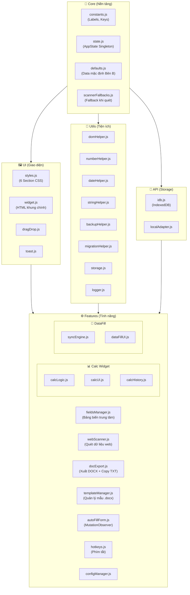

# VNPT PROJECT BRAIN CONTEXT (OPTIMIZED)
*Ngày cập nhật: 00:04:37 13/4/2026*

## 1. TÀI LIỆU CỐT LÕI (CORE DOCUMENTS)

### File: PROJECT_MEMORY.md

# VNPT Project Memory

File này lưu trữ các quyết định quan trọng, lỗi đặc thù và trạng thái dự án để AI luôn duy trì được bối cảnh giữa các phiên làm việc.

## 1. Mục tiêu hiện tại (Current Objective)

- [x] Triển khai Sync 2 chiều (Reverse Sync) cho trường "Tên Tổ Chức" (Đã bị USER gỡ bỏ thủ công).
- [x] Sửa lỗi Quét địa chỉ (id="duong", tỉnh) lấy nhầm ID số thay vì Title/Text.
- [x] Hợp nhất menu cài đặt và sao lưu.
- [x] Hệ thống kiểm tra dữ liệu bắt buộc (Required Fields Validation).
- [x] Cải thiện hệ thống "Trí nhớ dự án" (Đã khôi phục và đồng bộ).
- [x] Kiểm tra tính nhất quán của hệ thống Rules/Workflow với người dùng.
- [x] Triển khai tính năng Phân loại dữ liệu Local (Raw Scan).
- [x] Xây dựng công cụ Selector Inspector (Bắt selector bằng click).
- [x] Nâng cấp Selector Inspector: Batch Capture mode, Top Banner, Esc support và Smart Labeling.
- [x] Tích hợp API tra cứu MST doanh nghiệp (Xinvoice).
- [x] Tự động hóa trường Nơi cấp ĐKDN theo Tỉnh (`SKDT {Tỉnh}`).
- [x] Sửa lỗi VNPT Calculator tự động nhảy về số 0 khi xóa trắng ô nhập liệu.
- [x] Cải tiến Field Linker: Hỗ trợ Smart Mapping (tìm label/wrapper id khi input yếu).
- [x] Tích hợp visual link (🔗) vào phần Mapping Calc trong Banner.
- [x] Tích hợp Quét nội dung Mail (Gmail/Outlook) và Quét Màn hình trực tiếp qua AI Scanner.
- [x] Nâng cấp hệ thống Local History (Tối đa 10 bản).
- [x] Quản lý bản ghi (Khôi phục/Xóa) trực tiếp trên nút ⏪.
- [x] Chuyển đổi cơ chế nút 🗑 sang lưu History thay vì export file JSON.
- [x] Khử bỏ thông báo "Save password" của trình duyệt cho các trường API Key và Cloud Pass.
- [x] Phát hành bản cập nhật v1.6.5 (Tối ưu model, Backup nội bộ, Fix Autofill).
- [x] Tự động tách Tỉnh/Thành phố từ MST và điền thông tin thông minh vào dropdown (Select2).
- [x] Cấu trúc lại nhóm địa chỉ (Tỉnh trái, Huyện/Xã/Đường phải) theo layout VNPT mới.
- [x] Tối ưu Tra cứu MST: Chỉ cập nhật Tên tổ chức/Địa chỉ và đồng bộ có mục tiêu (Targeted Sync).
- [x] Gộp chung logic xử lý cho trường Xã và Huyện thành một thực thể duy nhất (`xaHuyen`) để phù hợp với thay đổi trên trang web VNPT.
- [x] Sửa lỗi Tỉnh/Q.Huyện không nhận giá trị khi nhập Địa chỉ Full vào input hoặc qua Data Fill.
- [x] Phủ sóng tính năng Real-time Sync: (1) Widget cập nhật form ngay khi gõ/paste (không chờ blur), (2) Sync Mapping trang web bắt được sự kiện dropdowns thay đổi.
- [x] Điều chỉnh hướng sync value (3 chiều: Tự do ↔, Ghi đè form ⬇, Hút từ form ⬆) thay thế biểu tượng = (drag-handle) bằng nút điều hướng.

## 2. Nhật ký Quyết định (Decision Log)

- **2026-04-07 (Glassmorphism UI)**: Thay thế hoàn toàn giao diện cũ sang phong cách mờ đục (blur) với màu Indigo/Slate để tăng tính sang trọng.
- **2026-04-07 (Storage Abstraction)**: Di chuyển toàn bộ logic `localStorage` vào `src/api/storage/` để quản lý tập trung và tránh xung đột dữ liệu.
- **2026-04-09 (Memory System)**: Quyết định dùng file `PROJECT_MEMORY.md` kết hợp `.cursorrules` để AI "nhớ" tốt hơn.
- **2026-04-12 (2-Way Sync - Tên Tổ Chức)**: Triển khai tính năng đồng bộ ngược (Page -> Widget). *Lưu ý: USER đã gỡ bỏ tính năng này thủ công ngay sau đó.*
- **2026-04-12 (Address Title Extraction Fix)**: Sửa lỗi hàm `scanFullAddress` và `getProvinceName` lấy giá trị `.value` (ID) của thẻ SELECT thay vì lấy `.text` (Title), dẫn đến việc địa chỉ "duong" hoặc "tỉnh" chỉ hiện số. Đã gom nhóm logic vào hàm `getElValueText` dùng chung.
- **2026-04-12 (Local History Enhancement)**: Chuyển đổi cơ chế sao lưu từ file JSON sang Local Storage (tối đa 10 bản) cho nút 🗑. Nâng cấp nút ⏪ thành menu quản lý bản ghi (khôi phục/xoá) để tối ưu trải nghiệm người dùng.
- **2026-04-12 (No More Password Prompt)**: Chuyển đổi các trường Password/API Key sang `type="text"` kết hợp CSS `-webkit-text-security: disc` để đánh lừa browser password manager, giải quyết triệt để thông báo "Save password?".
- **2026-04-12 (Advanced Selector Inspector)**: Thay đổi toàn diện công cụ 🔍. Thêm Banner hướng dẫn phía trên, cho phép chọn nhiều trường liên tục (Batch Capture), hỗ trợ phím Esc và cải thiện thuật toán tìm nhãn (label) tự động.
- **2026-04-12 (Validation Sync Fix)**: Tái cấu trúc logic validation trong `fieldsManager.js`, tách thành hàm `refreshRowValidation` dùng chung. Cho phép cập nhật giá trị rỗng từ AI để kích hoạt cảnh báo `field-required-empty` chính xác hơn.
- **2026-04-12 (Address Layout Grouping)**: Cập nhật `getVNPTAddressGroup` để gom Huyện và Xã về cột phải (col-sm-6) cùng với trường Đường, tách biệt với Tỉnh ở cột trái. Cải thiện logic tuần tự để đợi AJAX load Huyện/Xã.
- **2026-04-12 (Real-time Sync Perfection)**: Rút đoạn code duplicate trong `dataFillFeature` xóa bỏ conflict. Bổ sung `change` event listener vào `initSyncEngine` kéo theo khả năng bắt tín hiệu từ các Web-DOM dropdowns (kể cả ng-select2). Tại Widget, gắn debounce sync thẳng vào sự kiện `input` giúp form trên trang luôn cập nhật trực tiếp theo nhịp gõ của user thay vì phải đợi mất focus (blur).
- **2026-04-12 (Sync Direction Control)**: Thay thế chức năng drag-drop (kéo thả sắp xếp field) bằng nút điều chỉnh hướng sync (`↔`, `⬇`, `⬆`). Bổ sung `isFromWebForm` flag vào `addOrUpdateFieldRow` để kiểm soát dữ liệu sync từ Web Form lên Widget không bị ghi đè thuộc tính hướng, đảm bảo lưu trạng thái hướng độc lập cho người dùng.

## 3. Lỗi đặc thù & Giải pháp (Technical Gotchas)

- **VNPT Selectors**: Các input trên trang VNPT thường không có ID cố định. Luôn ưu tiên dùng `placeholder` hoặc `label` text.
- **Address Real-time Lag**: Sử dụng cooldown và cache map trong `domHelper.js` để tránh lag khi gõ địa chỉ.
- **Storage get/set Inconsistency**: Luôn stringify khi lưu và try-catch khi đọc để tránh crash khi parse dữ liệu không phải JSON.
- **Browser Password Heuristics**: Browsers như Chrome tự động hiện popup "Save password?" khi thấy `type="password"`. Giải pháp là dùng `type="text"` + `-webkit-text-security: disc` và `autocomplete="new-password"`.
- **SyncDir Override Issue**: Khởi tạo Field Data (khi load lại từ Web Scanner) có thể vô tình đè mất `syncDir` người dùng đã chọn. Đã thay tham số mặc định của `syncDir` về Null để tự động bỏ qua ghi đè cập nhật hướng khi có cờ `isFromWebForm`.

## 4. Trạng thái các tính năng (Status Map)

- **Export DOCX**: Hoạt động ổn định.
*   **AI Scanner**: Hoạt động ổn định (PDF/Ảnh/Mail/Screen).
*   **Local History**: Hoạt động ổn định (Tối đa 10 bản, hỗ trợ CRUD).
- **Cloud Sync**: Hoạt động ổn định (Firebase).
- **Real-time 2-way Form Sync**: Hỗ trợ đầy đủ Custom Direction (1/2 chiều).

---

_Ghi chú: AI phải cập nhật file này sau mỗi task lớn bằng workflow `/update-memory`._


---

### File: README.md

# VNPT Word Automation — Tampermonkey Userscript (Vite)

> **Phiên bản:** 1.5  |  **Build Tool:** Vite 5  |  **Môi trường:** Tampermonkey / hopdong.vnpt.vn

Userscript tự động hóa toàn bộ luồng nhập liệu hợp đồng VNPT:
- **Quét dữ liệu** từ portal web → điền tự động vào bảng biến
- **Xuất file DOCX** theo template có sẵn (URL Google Drive hoặc file local)
- **Copy text nhanh** bằng template văn bản tuỳ chỉnh (`@key` placeholder)
- **Tính thuế & phí dịch vụ** với bộ Calc Widget tích hợp
- **Đồng bộ hai chiều** giữa widget và các form trên trang web

---

## 📖 Mục lục

- [Tổng quan kiến trúc](#-tổng-quan-kiến-trúc)
- [Cấu trúc thư mục](#-cấu-trúc-thư-mục)
- [Module Map chi tiết](#-module-map-chi-tiết)
- [Hướng dẫn cài đặt & phát triển](#-hướng-dẫn-cài-đặt--phát-triển)
- [Luồng dữ liệu (Data Flow)](#-luồng-dữ-liệu-data-flow)
- [Tính năng chi tiết](#-tính-năng-chi-tiết)
- [Cấu hình & LocalStorage Keys](#-cấu-hình--localstorage-keys)
- [Quy tắc dành cho AI Agent](#-quy-tắc-dành-cho-ai-agent)

---

## 🏗️ Tổng quan kiến trúc

Dự án áp dụng **kiến trúc phân lớp** (Layered Architecture) loại bỏ hoàn toàn circular dependency. Các lớp giao tiếp một chiều từ trên xuống dưới, và sử dụng **Event Bus** để các module giao tiếp ngang hàng mà không cần `import` trực tiếp lẫn nhau.



---

## 📂 Cấu trúc thư mục

```text
tampermonkey-vite/
│
├── 📄 package.json          # Dependencies & npm scripts
├── 📄 vite.config.js        # Cấu hình build Vite + Tampermonkey Header banner

... (phần còn lại đã được lược bỏ để tiết kiệm context) ...

---

## 2. TÓM TẮT CẤU TRÚC MÃ NGUỒN (CODE LOGIC SUMMARIES)

### Thư mục: src/core

| File | Mô tả |
| :--- | :--- |
| constants.js | /**<br>* @file constants.js<br>* @desc Tất cả hằng số dùng chung toàn dự án: localStorage keys, DEFAULT_LABELS.<br>* @exports DEFAULT_LABELS    — map{id → tên nhãn tiếng Việt} dùng cho webScanner<br>* @exports LOCAL_KEY_*       — localStorage keys cho VNPT Export Widget<br>* @exports SK_*              — localStorage keys cho Calc & AutoFill Widget<br>* @seeAlso core/defaults.js (data mặc định), core/state.js (AppState)<br>*/ |
| defaults.js | /**<br>* @file defaults.js<br>* @desc Dữ liệu mặc định cho bên B (VNPT Hà Nội).<br>*       File này KHÔNG chứa logic — chỉ là data thuần.<br>* @exports DEFAULT_DATA  — object{key: string} dùng làm giá trị mặc định<br>* @seeAlso syncEngine.js (consumer), fieldsManager.js (consumer)<br>*/ |
| scannerFallbacks.js | /**<br>* @file scannerFallbacks.js<br>* @desc Cấu hình các giá trị mặc định cho scanner khi không tìm thấy dữ liệu trên web.<br>*       Tách riêng logic gán giá trị mặc định (như ngày hiện tại, số lượng mặc định)<br>*       ra khỏi logic quét DOM.<br>*/<br>/**<br>* Lấy giá trị mặc định dựa trên ID của trường (field ID).<br>* @param {string} id_can_tim - ID của trường cần lấy fallback.<br>* @returns {string} Giá trị mặc định hoặc chuỗi rỗng. |
| state.js | /**<br>* @file state.js<br>* @desc Singleton AppState — lưu tham chiếu các DOM elements và trạng thái toàn cục.<br>*       Sử dụng Proxy để hỗ trợ reactivity (lắng nghe thay đổi qua .on()).<br>*/ |

### Thư mục: src/features

| File | Mô tả |
| :--- | :--- |
| autoFillForm.js | /**<br>* @file autoFillForm.js<br>* @desc Tự động điền và đồng bộ các trường cố định ngay khi trang load hoặc AJAX render form.<br>*       Sử dụng MutationObserver để detect form mới, sau đó điền: chức vụ, nơi cấp CCCD,<br>*       đồng bộ địa chỉ, SĐT, email, MST theo cặp field tương ứng.<br>* @exports setupAutoFillForm  — khởi tạo MutationObserver + chạy fill lần đầu<br>* @seeAlso utils/domHelper.js (syncSetValue), dataFillFeature.js (fill nâng cao)<br>*/<br>// src/features/autoFillForm.js |
| calcWidgetFeature.js | /**<br>* @file calcWidgetFeature.js<br>* @desc Khởi tạo và điều phối Calc & AutoFill Widget (widget phụ, nổi góc màn hình).<br>*       Bao gồm: title bar, calculator thuế (trước/thuế/sau/bằng chữ), lịch sử,<br>*       dock/undock, cấu hình field-mapping (⚙️), và gọi renderDataFillTabs().<br>* @exports initCalcWidget  — tạo toàn bộ DOM và gán logic cho widget<br>* @seeAlso dataFillFeature.js (tab data), ui/dragDrop.js (dock/drag), core/constants.js (SK_*)<br>*/<br>// src/features/calcWidgetFeature.js |
| configManager.js | /**<br>* @file configManager.js<br>* @desc Quản lý việc Nhập (Import) và Xuất (Export) cấu hình JSON cho VNPT Export Widget.<br>*       Bao gồm: Fields data, Templates list, Widget Position & Size.<br>* @exports exportConfig — Hàm xuất JSON tải về máy<br>* @exports importConfig — Hàm nhập JSON từ máy người dùng<br>*/ |
| dataFillFeature.js | /**<br>* @file dataFillFeature.js<br>* @desc Quản lý 3 tab dữ liệu (Custom / Default / Sync) trong Calc Widget.<br>*       Bao gồm: render giao diện tab, CRUD dữ liệu, import/export JSON,<br>*       và engine tự động đồng bộ field theo mapping khi user gõ trên trang.<br>* @exports renderDataFillTabs  — render toàn bộ phần Data vào widget<br>* @exports doFillData          — điền dữ liệu merged (default+custom) lên trang<br>* @exports doSyncData          — trigger đồng bộ theo sync-map thủ công<br>* @exports DEFAULT_DATA        — re-export từ core/defaults.js (backward compat)<br>* @seeAlso core/defaults.js (data), calcWidgetFeature.js (caller), core/constants.js (keys)<br>*/ |
| docExport.js | /**<br>* @file docExport.js<br>* @desc Xử lý xuất file DOCX từ template bằng docxtemplater + PizZip.<br>*       Bao gồm: render DOCX (fill data), tự động cập nhật tên file xuất,<br>*       và ưu tiên template: URL buffer → file local.<br>* @exports initDocExport  — gán click handler cho nút xuất DOCX và logic tên file<br>* @seeAlso templateManager.js (template buffer), fieldsManager.js (data source)<br>*/<br>// src/features/docExport.js |
| fieldsManager.js | /**<br>* @file fieldsManager.js<br>* @desc Quản lý bảng fields (danh sách key-value-label-sync) trong VNPT Export Widget.<br>*       Đã tối ưu: Sử dụng Storage utility, Reactive State (AppState.on), DOM Cache.<br>*/ |
| hotkeys.js | /**<br>* @file hotkeys.js<br>* @desc Quản lý phím tắt động cho toàn bộ ứng dụng.<br>*       Hỗ trợ cấu hình phím tắt, lưu trữ và ghi nhận phím mới từ UI.<br>*/ |
| profileManager.js | /**<br>* @file profileManager.js<br>* @desc Quản lý các cấu hình mặc định (Side B) cho từng chi nhánh VNPT khác nhau.<br>*/ |
| selectorInspector.js | /**<br>* @file selectorInspector.js<br>* @desc Công cụ "Soi" trường dữ liệu (Selector Inspector).<br>*       Giúp người dùng bắt ID/Name/FormControlName bằng cách di chuột và click trực tiếp trên web.<br>*/ |
| templateManager.js | /**<br>* @file templateManager.js<br>* @desc Quản lý danh sách template DOCX (lưu URL hoặc file local qua IndexedDB).<br>*       Bao gồm: load/save danh sách, fetch từ URL (Google Drive), lưu file local vào<br>*       IndexedDB (idbSave/idbLoad), render UI danh sách, chọn/xoá/đổi tên template.<br>* @exports loadTemplates         — đọc danh sách template từ localStorage<br>* @exports fetchTemplateFromUrl  — tải ArrayBuffer từ URL qua GM_xmlhttpRequest<br>* @exports saveLocalTemplate     — lưu file local vào IDB + cập nhật danh sách<br>* @exports renderTemplateManager — render/refresh UI danh sách template vào container<br>* @seeAlso api/storage/idb.js (IndexedDB), widget.js (host container), docExport.js (consumer)<br>*/ |
| webScanner.js | /**<br>* @file webScanner.js<br>* @desc Quét các trường (fields) trên trang web và đồng bộ vào bảng fields của widget.<br>*       Bao gồm: nút "Quét" lấy values từ DOM theo DEFAULT_LABELS keys,<br>*       và listener input/change để tự động cập nhật khi user gõ trực tiếp trên web.<br>* @exports initWebScanner  — gán click/input/change listeners cho nút Quét<br>* @seeAlso core/constants.js (DEFAULT_LABELS), fieldsManager.js (addOrUpdateFieldRow)<br>*/ |

### Thư mục: src/api

| File | Mô tả |
| :--- | :--- |
| firebaseConfig.js | No description available. |
| firebaseService.js | No description available. |
| gemini.js | /**<br>* @file gemini.js<br>* @desc Utility để kết nối với Google Gemini API.<br>*       Hỗ trợ cả text-only và multimodal (image/pdf).<br>*/<br>/**<br>* Gọi API Gemini để xử lý nội dung.<br>* @param {Object} options - Các tùy chọn gọi API<br>* @param {string} options.apiKey - Gemini API Key<br>* @param {string} options.model - Tên mô hình (ví dụ: gemini-2.0-flash) |
| mstService.js | /**<br>* @file mstService.js<br>* @desc Dịch vụ tra cứu mã số thuế doanh nghiệp qua API VietQR.<br>*/ |
| remoteConfig.js | No description available. |

### Thư mục: src/utils

| File | Mô tả |
| :--- | :--- |
| backupHelper.js | /**<br>* @file backupHelper.js<br>* @desc Hỗ trợ xuất/nhập toàn bộ cấu hình dự án ra file JSON.<br>*/ |
| common.js | /**<br>* @file common.js<br>* @desc Các hàm tiện ích dùng chung (debounce, v.v.)<br>*/<br>/**<br>* Hàm chống rung (debounce)<br>* @param {Function} func<br>* @param {number} wait<br>* @returns {Function}<br>*/ |
| crypto.js | /**<br>* @file crypto.js<br>* @desc Cung cấp các hàm mã hóa/giải mã đơn giản để bảo vệ API Keys khi lưu trên Cloud.<br>*       Sử dụng kết hợp ID máy (nếu có thể) hoặc một salt cố định.<br>*/<br>// Một key đơn giản để obfuscate dữ liệu (có thể cải tiến bằng cách lấy fingerprint trình duyệt) |
| dateHelper.js | /**<br>* @file dateHelper.js<br>* @desc Các hàm bổ trợ xử lý ngày tháng năm.<br>*/ |
| domHelper.js | No description available. |
| fileHelper.js | /**<br>* @file fileHelper.js<br>* @desc Các hàm tiện ích xử lý tệp tin: Chuyển đổi URL/Blob sang Base64 trong môi trường Tampermonkey.<br>*/<br>/**<br>* Tải một file từ URL và chuyển sang Base64 dùng GM_xmlhttpRequest (để bypass CORS).<br>* @param {string} url<br>* @param {string} fileName<br>* @returns {Promise<{base64: string, mimeType: string, name: string}>}<br>*/ |
| localClassifier.js | /**<br>* @file localClassifier.js<br>* @desc Logic bóc tách dữ liệu từ văn bản thô bằng Regex (không dùng AI).<br>*       Tối ưu cho mẫu Giấy đăng ký doanh nghiệp và căn cước công dân.<br>*/<br>/**<br>* Các hàm helper chuẩn hóa dữ liệu<br>*/ |
| logger.js | No description available. |
| migrationHelper.js | No description available. |
| numberHelper.js | // src/utils/numberHelper.js |
| storage.js | /**<br>* @file storage.js<br>* @desc Tiện ích quản lý dữ liệu lưu trữ (Hỗ trợ localStorage và Tampermonkey GM_storage).<br>*       Đã tối ưu: JSON tự động, xử lý lỗi, Debounce ghi đĩa và Cache nội bộ.<br>*/ |
| stringHelper.js | /**<br>* @file stringHelper.js<br>* @desc Các hàm tiện ích xử lý chuỗi: Levenshtein distance, fuzzy matching.<br>*/<br>/**<br>* Tính khoảng cách Levenshtein giữa 2 chuỗi.<br>* @param {string} a<br>* @param {string} b<br>* @returns {number}<br>*/ |

## 3. DANH MỤC QUY TRÌNH (WORKFLOWS MAP)

- **/add-feature**: Quy trình chuẩn để tạo một module tính năng mới từ A-Z
- **/add-field**: Cách thêm một trường dữ liệu (field) mới vào toàn bộ hệ thống
- **/add-template**: Quy trình thêm một mẫu Template DOCX từ Google Drive hoặc URL
- **/api-request**: Cách gọi API ngoài an toàn và đúng chuẩn Tampermonkey
- **/bug-report**: Quy trình báo cáo và sửa lỗi hiệu quả, tối thiểu token đầu vào.
- **/debug-ui**: Quy trình sửa lỗi hiển thị và tương tác trên web đích
- **/dev-all**: Quy trình build và chạy server phát triển song song
- **/export-json**: Quy trình bảo trì và cập nhật chức năng xuất/nhập file JSON (Backup)
- **/release**: Quy trình tự động hóa phát hành bản cập nhật (Bump version, Build, Commit, Pull Rebase, Push)
- **/reset-all**: Quy trình xóa sạch dữ liệu cũ để bắt đầu môi trường test mới
- **/start**: Không có mô tả.
- **/sync-logic**: Cách cấu hình để Widget tự động điền dữ liệu lên trang web
- **/test-sync**: Công cụ/Quy trình debug nhanh CSS selectors và IDs trên trang web VNPT
- **/update-memory**: Quy trình tóm tắt và cập nhật "Bộ nhớ dự án" sau mỗi task lớn.
- **/update-ui**: Quy trình cập nhật hoặc sửa đổi giao diện (CSS) cho các widget
- **/upnote**: Tổng hợp brain và đẩy lên NotebookLM dự án.
- **/_index**: Danh mục nhanh (Cheat-sheet) các workflow hệ thống

> *Lưu ý: Để xem chi tiết workflow, hãy dùng lệnh view_file trực tiếp vào file trong thư mục .agents/workflows/*

## 4. QUY TẮC DỰ ÁN (.cursorrules)

AI **PHẢI** tuân thủ bộ quy tắc trung tâm tại: [docs/RULES.md](file:///c:/Users/Chien/vnpt-tampermonkey-vite/docs/RULES.md)

### 🚀 Quy tắc Ưu tiên (Quick Reference):
1. AI **PHẢI** đọc [.notebooklm/brain_context.md](file:///c:/Users/Chien/vnpt-tampermonkey-vite/.notebooklm/brain_context.md) ngay khi bắt đầu.
2. **Planning First**: Lập `implementation_plan.md` và chờ xác nhận trước khi code.
3. **Execution**: Chỉ code sau khi người dùng gõ "ok", "trien khai" hoặc "y".
4. **Graphify**: Đọc `graphify-out/GRAPH_REPORT.md` để hiểu kiến trúc trước khi tìm code.
5. **Language**: Toàn bộ phản hồi và code comments là **Tiếng Việt**.
6. **Slash Commands**: Dùng phím `/` để mở menu gợi ý và chọn các workflow từ `.agents/workflows/` (ví dụ: `/update-memory`).

Xem chi tiết tại [RULES.md](file:///c:/Users/Chien/vnpt-tampermonkey-vite/docs/RULES.md) để biết về tiêu chuẩn JSDoc, Error Handling, State Management và Design System (Glassmorphism).


