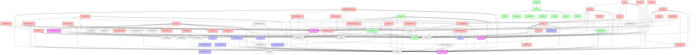

# Architecture Graph

Sơ đồ này được tạo tự động bởi `scripts/generate_graph.cjs`. Giúp theo dõi các mối quan hệ phụ thuộc giữa các module trong dự án.

```mermaid
flowchart TD
    classDef core fill:#f9f,stroke:#333,stroke-width:2px;
    classDef api fill:#bbf,stroke:#333,stroke-width:1px;
    classDef ui fill:#bfb,stroke:#333,stroke-width:1px;
    classDef feature fill:#fbb,stroke:#333,stroke-width:1px;
    classDef util fill:#eee,stroke:#333,stroke-width:1px,stroke-dasharray: 5 5;

    core_constants["constants.js"]:::core
    core_defaults["defaults.js"]:::core
    core_scannerFallbacks["scannerFallbacks.js"]:::core
    core_state["state.js"]:::core
    api_firebaseConfig["firebaseConfig.js"]:::api
    api_firebaseService["firebaseService.js"]:::api
    api_gemini["gemini.js"]:::api
    api_mstService["mstService.js"]:::api
    api_remoteConfig["remoteConfig.js"]:::api
    api_storage_firebaseAdapter["firebaseAdapter.js"]:::api
    api_storage_idb["idb.js"]:::api
    api_storage_index["index.js"]:::api
    api_storage_localAdapter["localAdapter.js"]:::api
    features_autoFillForm["autoFillForm.js"]:::feature
    features_calcWidgetFeature["calcWidgetFeature.js"]:::feature
    features_configManager["configManager.js"]:::feature
    features_dataFillFeature["dataFillFeature.js"]:::feature
    features_docExport["docExport.js"]:::feature
    features_fieldsManager["fieldsManager.js"]:::feature
    features_hotkeys["hotkeys.js"]:::feature
    features_mockDataGenerator["mockDataGenerator.js"]:::feature
    features_profileManager["profileManager.js"]:::feature
    features_templateManager["templateManager.js"]:::feature
    features_webScanner["webScanner.js"]:::feature
    features_calc_calcHistory["calcHistory.js"]:::feature
    features_calc_calcLogic["calcLogic.js"]:::feature
    features_calc_calcUI["calcUI.js"]:::feature
    features_calc_index["index.js"]:::feature
    features_dataFill_dataFillUI["dataFillUI.js"]:::feature
    features_dataFill_index["index.js"]:::feature
    features_dataFill_syncEngine["syncEngine.js"]:::feature
    features_fields_linker["linker.js"]:::feature
    features_fields_mode["mode.js"]:::feature
    features_fields_reverseSync["reverseSync.js"]:::feature
    features_fields_row["row.js"]:::feature
    features_fields_store["store.js"]:::feature
    features_fields_sync["sync.js"]:::feature
    features_fields_ui["ui.js"]:::feature
    features_fields_validation["validation.js"]:::feature
    features_mailScan_mailScanner["mailScanner.js"]:::feature
    features_pdfScan_geminiOcr["geminiOcr.js"]:::feature
    features_pdfScan_index["index.js"]:::feature
    features_pdfScan_pdfScanUI["pdfScanUI.js"]:::feature
    features_rawScan_index["index.js"]:::feature
    features_rawScan_rawScan["rawScan.js"]:::feature
    features_screenScan_screenScanner["screenScanner.js"]:::feature
    ui_dragDrop["dragDrop.js"]:::ui
    ui_styles["styles.js"]:::ui
    ui_toast["toast.js"]:::ui
    ui_widget["widget.js"]:::ui
    ui_components_CloudSyncUI["CloudSyncUI.js"]:::ui
    ui_styles_calculator["calculator.js"]:::ui
    ui_styles_controls["controls.js"]:::ui
    ui_styles_fields["fields.js"]:::ui
    ui_styles_index["index.js"]:::ui
    ui_styles_linker["linker.js"]:::ui
    ui_styles_panel["panel.js"]:::ui
    ui_styles_scanner["scanner.js"]:::ui
    ui_styles_theme["theme.js"]:::ui
    utils_addressLearning["addressLearning.js"]:::util
    utils_backupHelper["backupHelper.js"]:::util
    utils_bridgeStore["bridgeStore.js"]:::util
    utils_common["common.js"]:::util
    utils_crypto["crypto.js"]:::util
    utils_dateHelper["dateHelper.js"]:::util
    utils_domHelper["domHelper.js"]:::util
    utils_fileHelper["fileHelper.js"]:::util
    utils_localClassifier["localClassifier.js"]:::util
    utils_logger["logger.js"]:::util
    utils_migrationHelper["migrationHelper.js"]:::util
    utils_numberHelper["numberHelper.js"]:::util
    utils_qrHelper["qrHelper.js"]:::util
    utils_storage["storage.js"]:::util
    utils_stringHelper["stringHelper.js"]:::util
    utils_tokenTracker["tokenTracker.js"]:::util
    utils_tests_test_address["test_address.js"]:::util

    core_defaults --> utils_dateHelper
    core_scannerFallbacks --> utils_dateHelper
    api_firebaseService --> api_firebaseConfig
    api_firebaseService --> utils_crypto
    api_gemini --> utils_tokenTracker
    api_remoteConfig --> api_firebaseService
    api_remoteConfig --> core_constants
    api_remoteConfig --> utils_storage
    api_storage_firebaseAdapter --> api_firebaseConfig
    api_storage_index --> api_storage_localAdapter
    api_storage_index --> api_storage_firebaseAdapter
    features_autoFillForm --> utils_domHelper
    features_autoFillForm --> core_scannerFallbacks
    features_calcWidgetFeature --> core_state
    features_calcWidgetFeature --> core_constants
    features_calcWidgetFeature --> ui_dragDrop
    features_calcWidgetFeature --> utils_numberHelper
    features_calcWidgetFeature --> utils_domHelper
    features_calcWidgetFeature --> features_dataFillFeature
    features_calcWidgetFeature --> core_defaults
    features_calcWidgetFeature --> utils_storage
    features_configManager --> ui_toast
    features_configManager --> features_fieldsManager
    features_configManager --> features_templateManager
    features_configManager --> utils_storage
    features_dataFillFeature --> core_constants
    features_dataFillFeature --> utils_domHelper
    features_dataFillFeature --> ui_toast
    features_dataFillFeature --> utils_storage
    features_dataFillFeature --> core_defaults
    features_dataFillFeature --> features_dataFill_syncEngine
    features_docExport --> utils_logger
    features_docExport --> core_state
    features_docExport --> api_storage_index
    features_docExport --> core_constants
    features_hotkeys --> utils_storage
    features_hotkeys --> core_constants
    features_hotkeys --> core_defaults
    features_hotkeys --> ui_toast
    features_mockDataGenerator --> features_fieldsManager
    features_mockDataGenerator --> utils_stringHelper
    features_profileManager --> utils_storage
    features_profileManager --> core_constants
    features_profileManager --> core_defaults
    features_templateManager --> core_constants
    features_templateManager --> ui_toast
    features_templateManager --> api_storage_idb
    features_templateManager --> utils_storage
    features_templateManager --> api_storage_index
    features_webScanner --> core_constants
    features_webScanner --> ui_toast
    features_webScanner --> features_fieldsManager
    features_webScanner --> core_scannerFallbacks
    features_webScanner --> core_state
    features_webScanner --> core_defaults
    features_webScanner --> api_remoteConfig
    features_webScanner --> utils_domHelper
    features_webScanner --> utils_stringHelper
    features_webScanner --> utils_backupHelper
    features_webScanner --> utils_common
    features_calc_calcHistory --> core_constants
    features_calc_calcHistory --> utils_storage
    features_calc_calcLogic --> utils_numberHelper
    features_calc_calcLogic --> utils_domHelper
    features_calc_calcUI --> core_state
    features_calc_calcUI --> core_constants
    features_calc_calcUI --> features_calc_calcHistory
    features_calc_calcUI --> features_calc_calcLogic
    features_calc_calcUI --> utils_numberHelper
    features_calc_calcUI --> features_dataFill_index
    features_calc_calcUI --> ui_dragDrop
    features_calc_calcUI --> core_defaults
    features_calc_calcUI --> utils_domHelper
    features_calc_calcUI --> utils_common
    features_calc_index --> features_calc_calcUI
    features_calc_index --> core_state
    features_calc_index --> core_constants
    features_calc_index --> features_calc_calcHistory
    features_dataFill_dataFillUI --> core_constants
    features_dataFill_dataFillUI --> ui_toast
    features_dataFill_dataFillUI --> api_storage_index
    features_dataFill_dataFillUI --> core_defaults
    features_dataFill_dataFillUI --> features_dataFill_syncEngine
    features_dataFill_dataFillUI --> utils_backupHelper
    features_dataFill_index --> features_dataFill_syncEngine
    features_dataFill_syncEngine --> core_constants
    features_dataFill_syncEngine --> utils_domHelper
    features_dataFill_syncEngine --> ui_toast
    features_dataFill_syncEngine --> core_defaults
    features_dataFill_syncEngine --> utils_storage
    features_dataFill_syncEngine --> utils_common
    features_fields_linker --> core_state
    features_fields_linker --> ui_toast
    features_fields_mode --> core_state
    features_fields_mode --> utils_storage
    features_fields_mode --> core_defaults
    features_fields_mode --> ui_toast
    features_fields_mode --> features_fields_row
    features_fields_mode --> features_fields_linker
    features_fields_mode --> features_fields_store
    features_fields_reverseSync --> features_fields_row
    features_fields_reverseSync --> core_state
    features_fields_reverseSync --> utils_common
    features_fields_reverseSync --> utils_domHelper
    features_fields_row --> core_state
    features_fields_row --> core_constants
    features_fields_row --> utils_domHelper
    features_fields_row --> api_mstService
    features_fields_row --> utils_stringHelper
    features_fields_row --> utils_addressLearning
    features_fields_row --> utils_common
    features_fields_row --> ui_toast
    features_fields_row --> features_fields_validation
    features_fields_row --> features_fields_linker
    features_fields_store --> core_state
    features_fields_store --> utils_storage
    features_fields_store --> features_fields_row
    features_fields_sync --> core_state
    features_fields_sync --> utils_domHelper
    features_fields_sync --> ui_toast
    features_fields_sync --> features_dataFill_syncEngine
    features_fields_ui --> core_state
    features_fields_ui --> utils_logger
    features_fields_ui --> utils_storage
    features_fields_ui --> ui_toast
    features_fields_ui --> features_fields_row
    features_fields_ui --> features_fields_store
    features_fields_ui --> features_fields_sync
    features_fields_ui --> features_fields_mode
    features_fields_validation --> core_constants
    features_mailScan_mailScanner --> utils_bridgeStore
    features_pdfScan_geminiOcr --> core_constants
    features_pdfScan_geminiOcr --> api_gemini
    features_pdfScan_index --> core_state
    features_pdfScan_index --> utils_storage
    features_pdfScan_index --> core_constants
    features_pdfScan_index --> features_pdfScan_geminiOcr
    features_pdfScan_index --> features_pdfScan_pdfScanUI
    features_pdfScan_index --> features_fieldsManager
    features_pdfScan_index --> ui_toast
    features_pdfScan_index --> utils_backupHelper
    features_pdfScan_index --> features_rawScan_rawScan
    features_pdfScan_index --> features_mailScan_mailScanner
    features_pdfScan_index --> utils_bridgeStore
    features_pdfScan_index --> features_screenScan_screenScanner
    features_pdfScan_index --> utils_fileHelper
    features_pdfScan_index --> utils_qrHelper
    features_pdfScan_index --> utils_stringHelper
    features_rawScan_rawScan --> api_gemini
    features_rawScan_rawScan --> core_constants
    features_rawScan_rawScan --> utils_localClassifier
    ui_dragDrop --> core_state
    ui_dragDrop --> core_constants
    ui_dragDrop --> utils_storage
    ui_styles --> ui_styles_index
    ui_widget --> core_state
    ui_widget --> features_templateManager
    ui_widget --> features_fieldsManager
    ui_widget --> core_constants
    ui_widget --> core_defaults
    ui_widget --> features_configManager
    ui_widget --> utils_storage
    ui_widget --> utils_backupHelper
    ui_widget --> features_hotkeys
    ui_widget --> ui_toast
    ui_widget --> api_gemini
    ui_widget --> ui_components_CloudSyncUI
    ui_widget --> api_remoteConfig
    ui_widget --> features_mockDataGenerator
    ui_components_CloudSyncUI --> api_firebaseService
    ui_components_CloudSyncUI --> ui_toast
    ui_components_CloudSyncUI --> core_state
    ui_styles_index --> ui_styles_theme
    ui_styles_index --> ui_styles_panel
    ui_styles_index --> ui_styles_fields
    ui_styles_index --> ui_styles_controls
    ui_styles_index --> ui_styles_calculator
    ui_styles_index --> ui_styles_scanner
    ui_styles_index --> ui_styles_linker
    utils_addressLearning --> utils_storage
    utils_addressLearning --> core_constants
    utils_backupHelper --> utils_storage
    utils_backupHelper --> ui_toast
    utils_domHelper --> utils_stringHelper
    utils_domHelper --> utils_common
    utils_migrationHelper --> utils_storage
    utils_migrationHelper --> core_constants
    utils_migrationHelper --> core_defaults
    utils_migrationHelper --> utils_logger
    utils_stringHelper --> utils_addressLearning
    utils_tokenTracker --> utils_storage
    utils_tests_test_address --> utils_stringHelper
```
